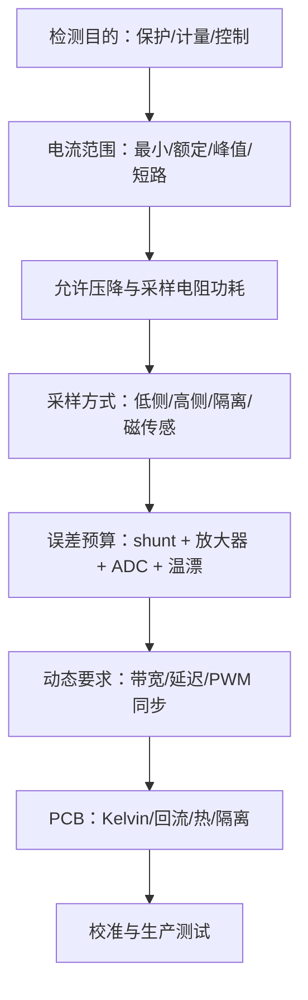

## 电流检测与功率测量：从采样位置到功率因数

本文整理自老智电子实验室《第二十八课：电流检测与功率测量》。这一课的主线不是“怎么把电流变成一个 ADC 数字”，而是先回答一个工程问题：在不同电压、功率、安全隔离和精度要求下，应当把电流信息从哪里取出来、用什么器件放大或数字化、最后怎样把电流和电压转换成功率量。

电流检测的结果通常继续服务于过流保护、电池充放电统计、电机驱动、电源效率评估、功率计量和闭环控制。它的边界也很明确：检测电路本身不能脱离被测回路存在，采样电阻会引入压降和发热，隔离式传感器会带来带宽与零漂问题，功率测量还必须区分直流、交流、有功、无功和视在功率。

### 课程结构

本课围绕四个问题展开：

1. 电流检测三种方式对比：低侧、高侧、霍尔/传感器方案。
2. 分流电阻选型设计：阻值、功耗、精度、温漂、封装和 PCB 寄生。
3. 精密电流检测 IC：INA199、INA219、INA226、INA228 等方案的作用边界。
4. 功率测量与校准：有功功率、无功功率、视在功率、功率因数和误差校正。

可以把整条链路理解为：

```text
被测电流
  -> 采样元件：分流电阻 / 霍尔传感器 / 电流互感器
  -> 信号调理：差分放大 / 隔离 / 滤波 / ADC
  -> 数字计算：电流、电压、功率、能量
  -> 应用动作：保护、计量、显示、控制、校准
```

这条链路的难点在于前级误差会被后级计算继承。若电流采样点选错，后面再高分辨率的 ADC 也只能精确地测到一个不代表真实负载电流的量。

### 电流检测的基本目标

电流不能像电压那样直接对地测量。工程上通常把电流转换成电压、磁场或数字脉冲，再由电路读取。最常见的电阻采样遵循欧姆定律：

$$
V_{sense}=I\cdot R_{shunt}.
$$

其中，$V_{sense}$ 是采样电阻两端压降，$I$ 是流经被测支路的电流，$R_{shunt}$ 是分流电阻。这个公式看起来简单，但它同时揭示了采样电阻的两难：阻值越大，信号越容易测；阻值越大，压降和功耗也越大。

采样电阻上的损耗为：

$$
P_{shunt}=I^2R_{shunt}.
$$

因此，分流电阻不是“随便串一个小电阻”。它必须同时满足信号幅度、允许压降、发热、精度和 PCB 引线误差要求。

### 三种电流检测方式

#### 低侧电流检测

低侧检测把分流电阻放在负载与地之间。优点是共模电压接近地，放大器和 ADC 容易设计，成本低，也适合普通运放或低端电流检测放大器。它的主要问题是抬高了负载地电位，负载的“地”不再等于系统地。

低侧检测适合电池小电流、LED、电机低成本保护、一般负载监测等场合。它不适合对地参考非常敏感的模拟前端，也不适合必须保持负载地完整性的系统。

#### 高侧电流检测

高侧检测把分流电阻放在电源正端与负载之间。它不会破坏负载地，更适合检测真实供电电流、短路到地故障和电源路径功耗。代价是检测放大器要承受较高共模电压，输入范围、共模抑制比和耐压必须满足系统电源。

高侧检测常用于电源输入、锂电池保护、USB/Type-C 供电、服务器或工业电源轨监测。若电源轨较高，普通运放往往不适合，需要专用高侧电流检测放大器或带 ADC 的电流监测 IC。

#### 霍尔传感器和电流互感器

霍尔传感器通过磁场检测电流，天然隔离，被测回路不需要串入采样电阻，因此插入损耗小。它适合大电流、电机驱动、工业控制和隔离安全要求高的场合。边界是零点漂移、温度漂移、带宽、外部磁场干扰和成本。

电流互感器适合交流电流，尤其适合电网或开关电源输入侧的隔离检测。它不能直接测直流，因为互感器依赖变化磁通；低频、直流偏置、铁芯饱和和开路高压都是使用边界。

#### 选择关系

| 方式 | 主要优点 | 主要缺点 | 典型边界 |
|---|---|---|---|
| 低侧分流 | 低成本、共模电压低、实现简单 | 抬高负载地，不能检测部分对地短路 | 低压、低成本、地参考不敏感 |
| 高侧分流 | 不破坏负载地，可测真实供电路径 | 需要高共模输入检测器件 | 电源轨监测、保护、计量 |
| 霍尔传感器 | 隔离、低插入损耗、适合大电流 | 零漂、温漂、带宽和成本 | 大电流、隔离、电机 |
| 电流互感器 | 隔离、适合交流和电网测量 | 不能测直流，可能饱和 | AC 计量、保护、隔离采样 |

### 分流电阻选型设计

#### 阻值不是越大越好

分流电阻的阻值通常由允许压降和测量分辨率共同决定。若系统允许的最大采样压降为 $V_{sense,max}$，最大电流为 $I_{max}$，则：

$$
R_{shunt}\leq \frac{V_{sense,max}}{I_{max}}.
$$

例如，若最大电流为 $5\ \mathrm{A}$，希望采样压降不超过 $50\ \mathrm{mV}$，则：

$$
R_{shunt}\leq \frac{50\ \mathrm{mV}}{5\ \mathrm{A}}=10\ \mathrm{m\Omega}.
$$

这并不表示一定选 $10\ \mathrm{m\Omega}$。若 ADC 或电流检测 IC 的输入失调较大，采样电压太小会导致低电流区误差放大；若阻值太大，满载发热又会恶化精度。工程上通常先给压降上限，再检查小电流分辨率，最后用功耗和热设计收敛。

#### 功耗和温升必须闭环计算

采样电阻的额定功率至少要覆盖最大电流下的损耗，并保留热裕量：

$$
P_{shunt,max}=I_{max}^2R_{shunt}.
$$

若 $I_{max}=5\ \mathrm{A}$、$R_{shunt}=10\ \mathrm{m\Omega}$，则：

$$
P_{shunt,max}=5^2\times 0.01=0.25\ \mathrm{W}.
$$

此时不应简单选 $0.25\ \mathrm{W}$ 电阻。因为环境温度、铜皮散热、封装热阻和脉冲电流都会改变实际温升。通常会选择额定功率更高的分流电阻，并查看厂商给出的功率降额曲线。

#### 温漂会把热变成测量误差

分流电阻温漂用 TCR 表示，单位常为 $\mathrm{ppm}/^\circ\mathrm{C}$。温度变化导致的相对阻值变化近似为：

$$
\frac{\Delta R}{R}\approx TCR\cdot \Delta T.
$$

这里 $TCR$ 需要换算为无量纲。例如 $50\ \mathrm{ppm}/^\circ\mathrm{C}=50\times 10^{-6}/^\circ\mathrm{C}$。若电阻温升 $60^\circ\mathrm{C}$，则阻值变化约为 $0.3\%$。对 0.1% 级电流测量来说，这已经不是小误差。

因此，高精度采样应优先选择低 TCR、四端 Kelvin 结构、较大封装或专用采样电阻，并让热源远离采样点。

#### PCB 寄生会让毫欧级测量失真

当 $R_{shunt}$ 只有几毫欧时，铜箔、焊盘和过孔电阻已经和采样电阻同量级。若用普通两端走线采样，测到的电压可能包含大电流路径上的铜阻压降。

Kelvin 连接的核心是把“大电流路径”和“电压检测路径”分开：

```text
大电流路径：Vin -> 焊盘 -> Rshunt -> 焊盘 -> Load
检测路径：      +Sense  ^       ^  -Sense
                细线直接从电阻内侧引出，不承载主电流
```

这种布线不是美观问题，而是测量定义问题。没有 Kelvin 连接，分流电阻的标称精度再高，也可能被 PCB 铜阻误差吞掉。

### 实际设计中的完整考量

电流检测电路的目标不是“ADC 能读到一个数”，而是这个数在全温、全电流范围、动态负载和生产偏差下都代表真实电流。设计时建议按下面顺序闭合：



保护电路需要快、可靠、在异常条件下不失效；计量电路需要准、稳定、可校准。二者可以共享采样电阻，但不一定适合共享同一条信号链。例如电机过流保护常用硬件比较器快速关断，而平均电流和功率统计可由 ADC 慢速读取。

低电流区常由放大器失调、ADC 噪声和热电势主导；高电流区常由分流电阻温升、TCR、增益误差和 PCB 铜阻主导。可以把误差来源用下面的形式组织：

$$
\Delta I\approx \sqrt{
\left(\frac{V_{OS}}{R_{shunt}}\right)^2+
\left(I\cdot E_{gain}\right)^2+
\left(I\cdot TCR\cdot \Delta T\right)^2+
I_{noise}^2
}.
$$

这个公式的作用不是替代数据手册，而是提醒：同一电流检测电路在小电流和大电流下的主导误差并不相同。

### PCB 布局布线要点

#### Kelvin 连接必须从采样电阻内侧取样

```text
错误：检测线接在大电流铜皮上

Vin ───────●──── Rshunt ────●──── Load
           │                │
        Sense+           Sense-
        包含焊盘/铜皮压降

正确：检测线从电阻检测端内侧引出

Vin ───●====[ Rshunt ]====●── Load
       │                  │
    Sense+             Sense-
    不承载主电流，尽量对称
```

采样电阻两端的检测线应作为差分小信号走线处理，远离 MOSFET 开关节点、电感、马达线和栅极驱动线。检测线不要跨越地分割，不要与功率回流共用细颈。毫欧级检测中，PCB 铜箔压降、焊盘热梯度和过孔电阻都可能变成可见误差。

#### 输入滤波必须对称

对 PWM 电流检测，常在放大器输入端加入对称 RC 滤波：

```text
Shunt+ ── Rf ──┐
               ├── current sense amp
Shunt- ── Rf ──┘
        │   │
        Cdiff 或对称电容
```

滤波器两侧必须对称，否则会把共模噪声转成差模误差，破坏 CMRR。带宽不是越高越好：过流保护需要快速响应，电池电量统计更关注低频平均值，电机 FOC 需要与 PWM 周期同步采样。

#### 高压检测要考虑爬电距离和隔离

高压母线电流检测不能只按原理图成立来判断。PCB 上的爬电距离、间隙、隔离放大器耐压、隔离电源、采样电阻耐压和污染等级都必须满足安全要求。高压分压或高侧采样还要检查单个电阻耐压，必要时用多个电阻串联均压。

### 电机三相电压电流检测

三相电机驱动的电流检测比普通负载复杂，因为电流随 PWM 快速变化，开关节点 dv/dt 高，共模噪声大，并且控制算法需要知道特定时刻的相电流。

#### 三电阻低侧采样

```text
Phase U low-side MOS ── Rshunt_U ── GND
Phase V low-side MOS ── Rshunt_V ── GND
Phase W low-side MOS ── Rshunt_W ── GND
```

三电阻低侧采样成本较低，可获得三相电流信息。边界是采样窗口受 PWM 状态限制，低边 MOS 关断时对应相电流不一定能直接测得。FOC 中通常要与 PWM 中点同步采样，并避开开关瞬间尖峰。

两电阻、单电阻方案成本更低，但需要根据开关状态重构相电流，对采样时刻、PWM 占空比、死区和算法要求更高。低速或极端占空比时可能出现不可观测区。

#### 相内采样和隔离采样

相内采样直接串在电机相线上，电流信息更完整，但共模电压高速跳变，要求高 CMRR、高 PWM 抑制能力的电流检测放大器。高压或大功率电机中，常用隔离放大器、隔离 $\Delta\Sigma$ 调制器、霍尔传感器或闭环磁传感器。

#### 高母线电压下的电压检测

高压母线电压通常用高阻分压，再送入隔离放大器或 ADC。分压电阻要关注：

$$
P_R=\frac{V^2}{R}.
$$

还要检查单个电阻耐压、串联均压、爬电距离、温漂、漏电和 PCB 污染。高压分压不应为了省面积只用一个普通贴片电阻承担全部电压。

### 减少杂散参数影响

| 杂散来源 | 影响 | 降低方法 |
|---|---|---|
| 采样电阻引脚电感 | 开关瞬间产生尖峰 | 低电感分流电阻、Kelvin、紧凑回路 |
| 铜皮电阻 | 毫欧级测量偏差 | 四端采样、粗铜皮、热对称 |
| 输入滤波不对称 | 共模转差模 | 两路电阻电容匹配、布局对称 |
| 走线电容 | 高频耦合开关节点噪声 | 远离 SW node，缩短高阻节点 |
| 地公共阻抗 | 负载电流变成测量误差 | 采样地单独回到测量参考 |
| 热梯度 | 热电势和阻值漂移 | 远离热源、对称铜皮、温度补偿 |

### 生产和调试要点

| 项目 | 为什么重要 | 建议 |
|---|---|---|
| 分流电阻焊接 | 焊料量和铜皮散热影响温升 | 使用推荐焊盘，避免手焊堆锡 |
| 采样电阻批次 | TCR、热电势、初始精度有批差 | 关键产品做来料抽检 |
| 零点校准 | 失调和热电势会造成零点电流 | 上电无负载采零或出厂校准 |
| 增益校准 | shunt 和放大器增益有误差 | 用标准电流点标定 |
| 温度验证 | 自热会改变阻值 | 做满载热稳定后的误差测试 |
| EMC 测试 | 检测线容易拾取开关噪声 | 对称滤波、短差分、良好地参考 |

### 精密电流检测 IC 的用途和边界

#### INA199：模拟输出检测放大器

INA199 一类器件把分流电阻上的小差分电压放大成模拟电压输出。它适合 MCU 已有 ADC、成本敏感、只需要电流瞬时值的系统。优点是接口简单、延迟低；边界是 ADC 精度、参考电压、采样噪声和后端校准全部要由系统承担。

#### INA219：集成 ADC 与 I2C

INA219 集成 ADC 和 I2C 接口，能降低模拟设计难度，常用于电池、电源轨和低成本功率监测。其典型分辨率为 12 位，精度等级约 1%。它适合中等精度的数字监测，不适合高精度计量或宽动态范围测量。

#### INA226 与 INA228：更高精度和更丰富寄存器

INA226 提供更高精度和 I2C 数字输出，适合服务器电源、工业电源和需要记录平均值的场景。INA228 提供更高分辨率和更高精度，适合高端功率分析、能量积分和更严格的计量需求。

选型时不应只看“位数”。需要同时检查：

- 共模电压范围是否覆盖电源轨。
- 输入失调电压是否允许低电流测量。
- ADC 转换时间和平均次数是否满足动态响应。
- 分流电阻最大压降是否落在输入范围内。
- 接口带宽和寄存器模型是否适合软件读取。
- 校准寄存器是否能表达目标 $R_{shunt}$ 和电流 LSB。

以 INA226 类器件为例，数字电流读数依赖校准寄存器。常见配置思路是先选择电流分辨率 $Current\_LSB$，再由数据手册公式计算校准值。视频课件给出的关键点包括：最高分辨率可按 $I_{max}/32768$ 估算，常取便于计算的整数 LSB；校准寄存器与 $Current\_LSB$、$R_{shunt}$ 相关；功率 LSB 通常由电流 LSB 推导。这里的边界是：这些公式只在所选芯片的数据手册定义下成立，不可跨型号照搬。

#### 常见器件和品牌坐标

| 器件/系列 | 类型 | 适合场景 | 主要注意点 |
|---|---|---|---|
| INA180/INA181/INA199 | 模拟输出电流检测放大器 | 低成本高侧/低侧检测 | 输出仍需 ADC，检查共模和失调 |
| INA240 | PWM 抑制电流检测放大器 | 电机相电流、半桥电流 | 输入滤波和布局仍要对称 |
| INA219/INA226/INA228 | 数字功率监测 | 电源轨、电池、服务器监测 | 采样速度、平均和校准寄存器要配置 |
| AD8210/AD8418 类 | 高侧/电机电流检测 | 汽车、工业、电机 | 共模范围和 PWM 抑制能力需查 |
| AMC1301/AMC3301、隔离调制器 | 隔离电流/电压采样 | 高压母线、逆变器、电机驱动 | 隔离电源、爬电距离和滤波 |
| ACS712/ACS758、TMCS1100 | 霍尔/隔离磁传感 | 大电流、隔离、安全测量 | 零漂、温漂、带宽和外部磁场 |
| LEM 闭环/开环电流传感器 | 工业电流传感 | 大电流、高隔离、工业控制 | 体积、成本和供电较高 |

常见品牌包括 Texas Instruments、Analog Devices、Allegro、LEM、Melexis、Honeywell、Tamura、Microchip、STMicroelectronics。型号表只用于建立选型方向，实际设计必须核对共模电压、隔离等级、带宽、失调、温漂、封装和认证。

### 功率测量与校准

#### 直流功率

直流场景下，功率计算最直接：

$$
P=VI.
$$

若电压和电流同时来自数字采样，必须注意采样时刻。电源负载变化较快时，电压和电流不同步会导致瞬时功率误差。若只关注平均功耗，可以通过同步采样、平均滤波或积分计算降低噪声影响。

#### 交流有功、无功和视在功率

交流系统中，电压和电流可能有相位差，也可能存在谐波。只用有效值相乘得到的是视在功率：

$$
S=V_{rms}I_{rms}.
$$

有功功率是一个周期内瞬时功率的平均值：

$$
P=\frac{1}{T}\int_0^T v(t)i(t)\,\mathrm{d}t.
$$

对于理想正弦波，若电压电流相位差为 $\varphi$，则：

$$
P=V_{rms}I_{rms}\cos\varphi.
$$

无功功率可写作：

$$
Q=V_{rms}I_{rms}\sin\varphi.
$$

视在功率、有功功率和无功功率满足：

$$
S=\sqrt{P^2+Q^2}.
$$

功率因数为：

$$
PF=\frac{P}{S}.
$$

这些公式的作用边界是“正弦稳态”或“按有效值和平均功率定义的周期信号”。若电流严重畸变，$PF$ 不只由相位角决定，还包含谐波畸变因素。实际电能计量芯片通常要同步采样电压、电流并做数字积分，而不是只测一个相位角。

### 常见误区

#### 分流电阻过小

分流电阻太小会让信号幅度低于可用范围。例如低于 $10\ \mathrm{mV}$ 时，放大器失调、ADC 分辨率、热电势和噪声都可能占据相当比例。采样电阻小能降低损耗，但它同时压低了信噪比。

#### 忽略分流电阻温漂

温漂会把发热转化为系统性误差。若目标精度为 0.5%，而分流电阻自热已经造成 0.3% 阻值变化，再叠加初始精度、放大器增益误差和 ADC 误差，系统精度很容易超标。

#### 高侧检测使用低共模运放

高侧检测的输入共模电压接近电源电压。普通 LM358 类运放通常不能直接承受高侧共模范围，也不能保证输入差分小信号在线性区内。高侧检测应使用专用电流检测放大器、隔离放大器或适合该共模范围的仪表放大器。

#### 忽略 PCB 寄生电阻

毫欧级测量必须使用 Kelvin 连接。否则焊盘、过孔、铜皮和连接器电阻会参与采样，导致测量结果随电流路径和温度变化而漂移。

#### 功率因数混淆有功和视在功率

很多负载的 $PF<1$。若只用 $V_{rms}I_{rms}$ 估计有功功率，会把无功和畸变成分也算进去。实际有功功率必须从瞬时功率平均得到，或由合适的计量芯片计算。

### 选型流程

1. 先确定检测目的：保护、计量、能量统计、闭环控制或诊断。
2. 再确定被测对象：直流还是交流，低压还是高压，是否需要隔离，电流范围和动态带宽是多少。
3. 选择采样方式：低侧分流、高侧分流、霍尔传感器或电流互感器。
4. 计算采样电阻：由允许压降给上限，由最小可测电流和 ADC/放大器噪声给下限。
5. 校核热和精度：功耗、温升、TCR、初始精度、Kelvin 布线和封装散热。
6. 选择检测 IC：共模范围、输入失调、增益误差、ADC 位数、接口、平均功能和校准寄存器。
7. 做系统校准：零点、增益、温度、相位和通道同步误差按实际应用校正。

### 关联笔记

电流检测中的分流电阻属于 [[Passive_Components-R|电阻]] 的精密应用，核心不是阻值本身，而是功率、温漂、封装和四端采样。四端采样能否成立，还取决于 [[Single_Point_Ground|单点接地]] 中讨论的功率回流和信号地分离。分流电阻后的模拟电压通常还要送入 [[ADC_Selection_and_Application|ADC]] 或电流检测 IC，因此必须检查输入驱动、采样电容建立时间和源阻抗边界；这些内容可与 [[Impedance_Matching|阻抗匹配]] 中的 ADC 前端讨论连起来看。输出或输入电源轨测量又常与 [[Power_Management_IC|电源管理芯片]] 配合，用于效率评估、过流保护和电池能量管理。若检测对象是电机、继电器或大电感负载，还应结合 [[Passive_Components-L|电感]] 中的电流纹波、磁饱和和瞬态能量理解。

### 小结

电流检测是一条完整测量链路：采样位置决定你测到哪一段电流，采样元件决定插入损耗和隔离能力，信号调理决定分辨率和误差，数字计算决定最终能否得到可靠功率。低侧、高侧、霍尔和互感器没有绝对优劣，只有边界不同。

工程上最常见的错误是只看一个参数：只看阻值、只看 ADC 位数、只看芯片精度或只看功率公式。真正可用的方案必须同时闭合电气范围、热设计、误差预算、PCB 寄生和校准流程。

### 参考链接

- [第二十八课：电流检测与功率测量](https://www.bilibili.com/video/BV1VtRjB6E7t/)
- [Texas Instruments: Current Sense Amplifiers](https://www.ti.com/amplifier-circuit/current-sense/overview.html)
- [Analog Devices: Current Sense Amplifiers](https://www.analog.com/en/product-category/current-sense-amplifiers.html)
