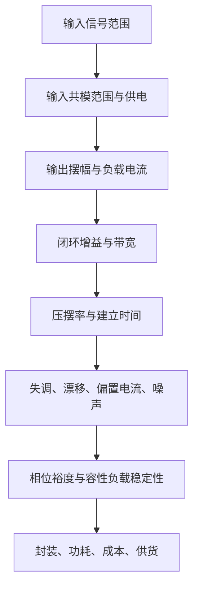

## 运算放大器参数与选型：静态误差、动态限制、稳定性与器件类型

运算放大器不是“无限增益、无限带宽、输入不取电流、输出想去哪就去哪”的理想器件。理想模型适合推导电路功能，真实参数决定这个功能在实际板子上能否成立。本篇专门整理运放的静态参数、动态参数、稳定性判断、补偿技巧、器件类型和常见型号；具体反相、同相、比较、恒流、恒压等电路见 [[Op_Amp_Classic_Circuits|运算放大器经典电路]]。

### 先建立一个选型总图



这个顺序很重要。若输入共模范围不满足，后面再低失调也没有意义；若输出摆幅不够，增益公式算得再漂亮也会饱和；若相位裕度不足，低噪声和高带宽反而可能让电路振荡。

### 静态参数

#### 输入失调电压 $V_{OS}$

输入失调电压可以理解为让输出刚好为零时，两个输入端之间仍需要补上的微小等效电压。闭环电路会把这个误差按噪声增益放大到输出端。

对同相或反相放大器，失调导致的输出误差近似为：

$$
V_{out,os}\approx V_{OS}\left(1+\frac{R_f}{R_g}\right).
$$

这里出现的是噪声增益，而不是一定等于信号增益。高增益直流放大、电流检测、桥式传感器、热电偶和积分器必须优先关注低失调和低漂移。

#### 失调电压温漂

失调温漂描述 $V_{OS}$ 随温度变化的程度，常用 $\mu\mathrm{V}/^\circ\mathrm{C}$ 表示：

$$
\Delta V_{OS}\approx Drift_{OS}\cdot \Delta T.
$$

零漂移运放通过斩波或自校准降低低频失调和漂移，但可能带来斩波纹波、输入电流尖峰和宽带噪声分布变化。

#### 输入偏置电流 $I_B$

输入偏置电流是流入或流出输入端的电流。它流过源阻抗和反馈电阻后会产生额外电压：

$$
V_{err}\approx I_B R_{source}.
$$

高阻传感器、光电二极管、积分器、pH 电极和大阻值分压电路应选 JFET 或 CMOS 输入运放，并注意 PCB 漏电、助焊剂残留和湿度。

#### 输入失调电流 $I_{OS}$

$I_{OS}$ 是两个输入偏置电流之差。反相放大器常在同相输入端加一个补偿电阻，让两个输入端看到的等效直流电阻相近：

$$
R_{comp}=R_{in}\parallel R_f.
$$

这个方法可以减小偏置电流造成的输出偏移，但不能消除失调电流本身；对偏置电流极小的 CMOS/JFET 运放，有时这个电阻反而引入热噪声，不一定需要。

#### 开环增益 $A_{OL}$

开环增益越高，闭环增益误差越小。有限开环增益下，闭环增益约为：

$$
A_{CL}\approx \frac{A_{ideal}}{1+\frac{A_{ideal}}{A_{OL}}}.
$$

低频精密放大和高闭环增益电路要关注开环增益及其随负载、温度和输出摆幅变化的情况。

#### CMRR 与 PSRR

CMRR 表示共模信号被抑制的能力：

$$
CMRR=20\log_{10}\frac{A_d}{A_c}.
$$

PSRR 表示电源波动转化为输入等效误差的程度。桥式传感器、电流检测和单电源系统中，CMRR 与 PSRR 往往直接决定低频误差底线。

#### 输入共模范围和输出摆幅

Rail-to-rail input/output 并不等于输入和输出在所有条件下都能真正到电源轨。很多运放只是在特定负载、温度和供电条件下接近电源轨。单电源 3.3 V 系统尤其要检查：

- 输入最低电压是否能到地。
- 输入最高电压是否能接近 $V_{CC}$。
- 输出在目标负载下距离电源轨还有多少余量。
- 输入跨越某些共模区间时失调是否突变。

### 噪声参数

#### 电压噪声和电流噪声

运放输入噪声通常分为电压噪声 $e_n$ 和电流噪声 $i_n$。源阻抗较低时，电压噪声主导；源阻抗较高时，电流噪声流过源阻抗形成的噪声可能主导。

输入等效噪声可粗略写成：

$$
e_{total}\approx \sqrt{e_n^2+(i_nR_s)^2+4kTR_s}.
$$

其中 $4kTR_s$ 是电阻热噪声项。低噪声设计不能只看运放，还要看源阻抗和反馈电阻。

#### $1/f$ 噪声

低频噪声会随频率降低而上升，常影响慢速传感器、直流测量和积分系统。斩波/零漂移运放通常低频噪声好，但高频纹波和开关注入要用滤波和布局处理。

### 动态参数

#### 增益带宽积 GBW

电压反馈运放常用增益带宽积估算闭环带宽：

$$
BW_{CL}\approx \frac{GBW}{NoiseGain}.
$$

反相放大器的噪声增益为：

$$
NoiseGain=1+\frac{R_f}{R_{in}}.
$$

这个公式说明高增益会牺牲带宽。若还要保持相位裕度，工程上通常不能把目标信号频率设计到闭环带宽边缘。

#### 压摆率 SR

压摆率限制输出最大变化速度。正弦波不发生压摆失真的条件为：

$$
SR\geq 2\pi f V_{pk}.
$$

例如输出峰值 $2\ \mathrm{V}$、频率 $100\ \mathrm{kHz}$，至少需要：

$$
SR\geq 2\pi\times 100\ \mathrm{kHz}\times 2\ \mathrm{V}\approx 1.26\ \mathrm{V}/\mu\mathrm{s}.
$$

实际要留裕量，因为大信号失真、负载和温度都会影响表现。

#### 建立时间

建立时间表示输出从阶跃变化后进入某个误差带所需时间。ADC 驱动、电荷采样、DAC 缓冲和多路复用切换都要关注建立到 $0.5LSB$ 或更小误差的时间，而不是只看 -3 dB 带宽。

#### 过载恢复时间

运放输入或输出过载后，内部节点可能饱和，恢复到线性状态需要时间。普通运放用作比较器时经常出现这一问题：输出翻转慢、延迟不确定，甚至锁在饱和边缘。高速阈值判断应使用比较器。

### 稳定性和相位裕度

负反馈稳定的核心是：在环路增益为 1 的频率附近，环路相位不能太接近 $-180^\circ$。相位裕度定义为：

$$
PM=180^\circ+\angle T(j\omega_c),
$$

其中 $T(j\omega)$ 是环路增益，$\omega_c$ 是 $|T|=1$ 的交越频率。工程上常希望相位裕度至少约 $45^\circ$，更稳妥的精密缓冲和 ADC 驱动常按 $60^\circ$ 左右考虑。

```text
相位裕度不足的常见诱因：

运放输出 ── 长线/大电容/ADC采样电容
      |
    反馈网络过长
      |
    输入和输出寄生耦合
```

#### 容性负载为什么危险

容性负载会和运放输出阻抗形成额外极点，降低相位裕度，导致振铃或振荡。常见补救方法是输出串联隔离电阻：

```text
运放输出 ── Riso ── 电容负载/ADC输入/线缆
     |
   反馈取点按具体电路决定
```

这个电阻的目标是隔离容性负载、改善相位裕度，不等同于传输线端接。二者区别见 [[Impedance_Matching|阻抗匹配]]。

#### 哪些运放不能直接用作跟随器

不是所有运放都 unity-gain stable。以下类型尤其要查数据手册：

| 类型 | 为什么不能随便接成跟随器 |
|---|---|
| 去补偿高速运放 | 为高闭环增益优化，单位增益相位裕度不足 |
| 某些电流反馈运放 | 反馈电阻值直接决定稳定性，不能按电压反馈经验随意改 |
| 高速大电流运放 | 对反馈布局和容性负载极敏感 |
| 特定低功耗 CMOS 运放 | 输出级驱动弱，带大电容可能振荡 |

使用前要查“unity-gain stable”“minimum stable gain”“recommended feedback resistor”“capacitive load drive”等条目。

### 补偿和抑制不平衡的方法

| 问题 | 常用方法 | 边界 |
|---|---|---|
| 输入偏置电流造成偏移 | 让两输入端等效电阻匹配，如 $R_{comp}=R_{in}\parallel R_f$ | 增加电阻热噪声，对 CMOS 输入不一定必要 |
| 失调电压过大 | 选低失调/零漂移运放，或做软件/硬件校准 | 零漂移可能有斩波纹波 |
| 容性负载振荡 | 输出串联 $R_{iso}$，反馈电容，减小负载电容 | 会降低速度或改变滤波响应 |
| 反相输入高频噪声 | $R_f$ 并联小电容限制带宽 | 电容过大会影响目标信号 |
| 输入过压 | 串联限流电阻、钳位二极管、保护网络 | 保护电流不能注入敏感基准或电源轨 |
| 高阻输入漏电 | 清洁 PCB、guard ring、缩短高阻节点 | 潮湿和污染会使 pA 级设计失效 |

### 运放类型

| 类型 | 优势 | 边界 | 常见用途 |
|---|---|---|---|
| 双极型输入运放 | 低电压噪声、精度好 | 偏置电流较大 | 低源阻抗精密放大、音频 |
| JFET 输入运放 | 输入阻抗高、偏置电流低 | 供电范围和噪声要具体查 | 高阻传感器、音频、滤波 |
| CMOS 输入运放 | 低功耗、低偏置、低压轨到轨 | 1/f 噪声和输入保护需关注 | MCU 前端、电池设备 |
| 零漂移/斩波运放 | 极低失调和漂移 | 斩波纹波、输入电流尖峰 | 低频精密测量、电流检测 |
| 电流反馈运放 | 高速、大信号性能好 | 反馈电阻不能随意改 | 视频、高速驱动 |
| 仪表放大器 | 高 CMRR、差分小信号 | 共模范围和输入保护要查 | 电桥、电流检测、生物电 |
| 比较器 | 开环高速翻转 | 不用于线性负反馈放大 | 阈值判断、过零、保护 |

### 常见型号与品牌

下表是学习和初筛用。型号不能脱离供电、封装、温度、噪声、速度和负载条件直接替换。

| 器件/系列 | 类型 | 适合场景 | 主要注意点 |
|---|---|---|---|
| LM358/LM324/LM358B | 低成本通用运放 | 低速传感器、简单放大、缓冲 | 非真正轨到轨，高速和精密不适合 |
| TL071/TL072/TL074 | JFET 输入 | 音频、高阻信号、滤波 | 供电电压较高，单 3.3 V 不适合 |
| NE5532/NE5534 | 低噪声音频 | 音频线路、低源阻抗 | 偏置电流、供电和输出摆幅要查 |
| MCP6001/6002/6004 | 低功耗 CMOS RRIO | 3.3 V MCU 前端、低速采样 | GBW 和驱动能力有限 |
| OPA333/OPA2333 | 零漂移精密 | 电桥、低频电流检测、传感器 | 斩波纹波和带宽边界 |
| OPA197/OPA2197 | 精密通用 | 工业模拟前端、滤波、缓冲 | 成本高于通用运放 |
| OPA1656/OPA16xx | 低噪声 FET 音频 | 音频、高性能缓冲 | 速度较高，布局和供电去耦要认真 |
| OP07/OPA277 | 精密双极 | 低频精密直流 | 输入范围、速度和供电限制 |
| ADA4522/AD8628 | 零漂移精密 | 高精度低频测量 | 斩波相关噪声和输出负载 |
| AD620/INA826/INA333 | 仪表放大器 | 微弱差分信号、电桥 | 共模范围和输入保护是关键 |
| LM393/LM339/TLV3501 | 比较器 | 阈值、过零、快速保护 | 属于比较器，不是线性运放 |

常见品牌包括 Texas Instruments、Analog Devices、Microchip、STMicroelectronics、onsemi、ROHM、Renesas、Nisshinbo、Diodes Incorporated。

### 不同电路优先看什么参数

| 电路 | 优先参数 | 推荐类型 |
|---|---|---|
| 低速同相/反相放大 | 输入输出范围、GBW、失调、噪声 | 通用 CMOS/双极运放 |
| 高阻传感器缓冲 | 输入偏置电流、漏电、输入保护 | JFET/CMOS 输入 |
| 电流检测 | 失调、漂移、CMRR、输入共模 | 零漂移运放或专用电流检测放大器 |
| ADC 驱动 | 建立时间、输出电流、容性负载稳定性、噪声 | RRIO、ADC driver、低噪声运放 |
| 有源滤波 | GBW、相位裕度、噪声、电容负载 | 低噪声电压反馈运放 |
| 音频 | 电压噪声、失真、输出驱动、供电 | 低噪声音频运放 |
| 比较阈值 | 传播延迟、滞回、输出结构 | 专用比较器 |
| 恒流源/恒压源 | 失调、输出摆幅、负载驱动、稳定性 | 精密运放加功率器件或专用 IC |

### 小结

运放选型要先保证工作范围，再谈精度和速度。静态参数决定直流误差，动态参数决定波形能否跟上，稳定性决定电路能否安静工作。好的运放设计不是把“高精度、高速、低噪声”堆在一起，而是按具体电路找出真正限制性能的参数。

### 关联笔记

- [[Op_Amp_Classic_Circuits|运算放大器经典电路]]：本篇参数会在具体电路中转化为增益、阈值、滤波、恒流和恒压设计边界。
- [[ADC_Selection_and_Application|ADC 选型与应用]]：ADC 驱动要同时满足建立时间、噪声和参考源稳定性。
- [[Current_Sensing_and_Power_Measurement|电流检测与功率测量]]：毫欧级采样对失调、CMRR、Kelvin 布局和漂移非常敏感。
- [[Voltage_Reference|电压基准源]]：基准缓冲和阈值生成需要低噪声、低漂移和稳定输出。
- [[Passive_Components-R|认识无源器件：电阻]]：反馈电阻、偏置补偿电阻和热噪声共同决定运放电路误差。

### 参考链接

- [Texas Instruments: Understanding Operational Amplifier Specifications](https://www.ti.com/lit/pdf/sloa011)
- [Texas Instruments: Op Amps for Everyone Design Guide](https://www.ti.com/lit/an/slod006b/slod006b.pdf)
- [Texas Instruments: Application Design Guidelines for LM324 and LM358 Devices](https://www.ti.com/lit/pdf/sloa277)
