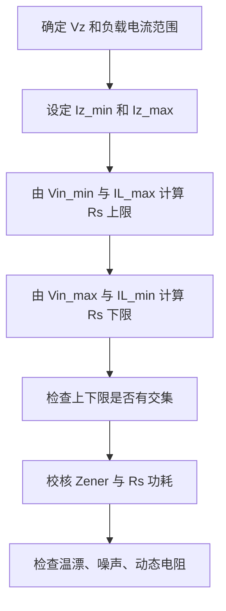

## 稳压二极管选型：反向击穿、功耗与稳压边界

这篇笔记是在学习稳压二极管选型资料后整理补充的工程笔记。稳压二极管，也常称齐纳管，是利用反向击穿区的相对稳定电压来实现钳位、简单稳压或参考电压的二极管。

它的作用范围很明确：适合低成本、低电流、精度要求不高的钳位和简易稳压；不适合替代高精度电压基准源，也不适合作为大功率稳压器。

### V-I 特性与击穿区

普通二极管正向导通时压降约为 $0.7\ \mathrm{V}$，反向时在击穿前只有很小漏电流。稳压二极管被设计为可在反向击穿区工作，其反向电压接近标称稳压值 $V_Z$。

在最简单的稳压电路中，输入电压经限流电阻后接稳压二极管：

```text
Vin -> Rs -> Vout
             |
             ZD
             |
            GND
```

限流电阻电流为：

$$
I_R=\frac{V_{in}-V_Z}{R_s}.
$$

负载电流为 $I_L$ 时，稳压管电流为：

$$
I_Z=I_R-I_L.
$$

稳压成立的条件是 $I_Z$ 必须落在数据手册允许范围内：既要大于最小稳定电流，又要小于最大功耗限制。

### 齐纳击穿与雪崩击穿

稳压二极管的“稳压”来自反向击穿，但低压和高压器件的主导机理不同。

| 机理 | 常见电压范围 | 温度特性 | 直觉 |
|---|---|---|---|
| 齐纳击穿 | 较低电压，常见约 5 V 以下 | 温度系数多为负 | 强电场下量子隧穿 |
| 雪崩击穿 | 较高电压，常见约 6 V 以上 | 温度系数多为正 | 载流子碰撞电离 |
| 混合区 | 约 5.1 V 到 6.2 V 附近 | 温漂相对较小 | 两种效应部分抵消 |

这解释了为什么 5.1 V 附近的稳压管常被用于低成本参考点。但温漂较低不等于噪声低、精度高或动态阻抗小。精密测量仍应优先使用 [[Voltage_Reference|电压基准源]]。

### 关键参数

#### 稳压值与测试电流

标称 $V_Z$ 通常是在指定测试电流 $I_{ZT}$ 下测得的。离开该电流点，稳压电压会因动态电阻变化而偏移。因此不能只看“5.1 V”，还要看测试条件、容差和电流范围。

#### 动态电阻

稳压管在击穿区不是理想电压源，可用动态电阻 $r_Z$ 近似描述电压随电流变化：

$$
\Delta V_Z\approx r_Z\Delta I_Z.
$$

$r_Z$ 越小，负载变化或输入变化引起的输出电压变化越小。低电流工作时动态电阻往往更大，稳压效果更差。

#### 功耗

稳压管功耗为：

$$
P_Z=V_ZI_Z.
$$

最大输入电压、最小负载电流甚至空载时，$I_Z$ 往往最大，此时最容易超过功耗。选型必须按最坏情况计算，而不是按典型输入电压计算。

#### 温度系数

低压稳压管多受齐纳击穿影响，温度系数可能为负；较高电压稳压管多受雪崩击穿影响，温度系数可能为正。约 5.1 V 附近常见温漂较低，因此常用于低成本参考点。但“温漂较低”不等于高精度基准，精密系统应使用专用 [[Voltage_Reference|电压基准源]]。

### 限流电阻计算

限流电阻要同时满足最大输入、最小输入、最大负载和空载条件。

在最小输入电压 $V_{in,min}$ 和最大负载电流 $I_{L,max}$ 下，稳压管仍要保持最小工作电流 $I_{Z,min}$：

$$
R_s\leq\frac{V_{in,min}-V_Z}{I_{L,max}+I_{Z,min}}.
$$

在最大输入电压 $V_{in,max}$ 和最小负载电流 $I_{L,min}$ 下，稳压管电流不能超过最大允许值：

$$
R_s\geq\frac{V_{in,max}-V_Z}{I_{L,min}+I_{Z,max}}.
$$

若两个条件没有重叠区，说明稳压二极管方案不适合该负载范围，应改用 LDO、DC-DC 或专用基准源。

#### 完整设计步骤

并联稳压必须同时检查最小输入、最大输入、最大负载、空载和功耗。



限流电阻功耗也要校核：

$$
P_R=I_R^2R_s=\frac{(V_{in}-V_Z)^2}{R_s}.
$$

最坏情况常出现在最高输入和最小负载时。若负载可能断开，所有限流电流都会流入稳压管：

$$
I_{Z,max}\approx \frac{V_{in,max}-V_Z}{R_s}.
$$

此时：

$$
P_{Z,max}=V_ZI_{Z,max}.
$$

### 三类典型应用

#### 简易稳压

适合给高阻抗、小电流、精度要求低的电路提供近似固定电压。边界是效率低、输出阻抗高、负载能力弱、温漂和噪声较大。

简易稳压的效率通常不高，因为即使负载电流很小，也要维持稳压管电流：

$$
\eta\approx \frac{V_ZI_L}{V_{in}(I_L+I_Z)}.
$$

因此电池设备和较大负载不适合长期用并联稳压管供电。

#### 过压钳位

稳压管可把节点电压限制在击穿附近，用于保护后级输入。但若浪涌能量较大，应优先选择 TVS，相关内容见 [[TVS_ESD_Protection|TVS 管和 ESD 保护器件]]。普通稳压管通常不具备承受大浪涌脉冲的封装和结面积。

典型输入钳位结构：

```text
外部信号 ── Rlimit ── MCU/ADC 输入
                  │
                 ZD
                  │
                 GND
```

$R_{limit}$ 的作用是限制钳位电流。不能只并一个稳压管而不限制电流，否则输入过压时稳压管或前级信号源可能过流。

#### 电平偏置或参考点

在低成本电路中，稳压管可提供粗略参考电压或偏置电压。若参考点参与 ADC、DAC、比较阈值或精密放大，则必须检查噪声、温漂、动态阻抗和电流稳定性。

稳压管噪声通常比专用基准源更明显。若用作比较器阈值，可能导致阈值抖动；若用作 ADC 参考，会直接降低有效位数。低噪声应用可在稳压点加 RC 滤波，但滤波会增加启动时间和动态响应延迟。

### 应用时必须注意什么

| 注意点 | 原因 | 建议 |
|---|---|---|
| 必须有限流路径 | 击穿后电流会快速上升 | 串联电阻、恒流源或前级限流 |
| 工作电流要接近测试点 | $V_Z$ 在不同电流下会变 | 查 $I_{ZT}$、$Z_Z$ 和工作曲线 |
| 空载功耗常最大 | 负载断开时电流全进稳压管 | 按空载和最高输入校核 $P_Z$ |
| 温漂不可忽略 | 阈值会随温度移动 | 估算 $TC\cdot \Delta T$ |
| 噪声较大 | 击穿区噪声会进入后级 | 精密参考换专用基准源 |
| 动态阻抗不为零 | 负载变化导致输出变化 | 负载变化大时改用 LDO 或基准缓冲 |
| 封装热阻限制功率 | 贴片小封装散热弱 | 按降额曲线和铜皮散热设计 |
| 不能替代 TVS | 浪涌能量和波形能力不同 | 接口浪涌使用 TVS/ESD 器件 |

### 与 TVS 和电压基准源的选择边界

| 需求 | 更合适的器件 | 原因 |
|---|---|---|
| 粗略钳位、小电流阈值 | 稳压二极管 | 成本低，电路简单 |
| ADC/DAC 精密参考 | 专用电压基准源 | 低噪声、低漂移、误差可控 |
| 电源输入浪涌 | TVS + 限流/保险丝 | 脉冲功率和钳位参数明确 |
| 持续过压保护 | OVP/eFuse/关断电路 | TVS 和稳压管不适合长期耗散 |
| 开关电源反馈 | TL431 类可调并联基准 | 可构成反馈基准，但需稳定性设计 |

### 常见型号与选择要点

常见系列包括小功率玻封/贴片稳压管、BZX 系列、MMBZ 系列等。选型时按以下顺序筛选：

1. 标称稳压值与容差是否满足阈值范围。
2. 测试电流是否接近实际工作电流。
3. 最大功耗和温度降额是否覆盖最坏情况。
4. 动态电阻是否允许负载变化。
5. 温度系数是否适合目标精度。
6. 封装热阻和浪涌能力是否足够。

#### 常见型号推荐

| 器件/系列 | 常见参数 | 推荐用途 | 不适合场景 |
|---|---|---|---|
| BZX84C 系列 | SOT-23、小功率、常见 $2.4\ \mathrm{V}$ 到数十伏、C 档多为 $\pm5\%$ | 小信号钳位、偏置、粗略阈值 | 大浪涌、大功耗、精密基准 |
| BZT52 系列 | SOD-123、贴片、小功率、多电压档 | 空间紧张的低功耗钳位 | 持续耗散较大时温升明显 |
| MMSZ 系列 | SOD-123、常见 500 mW 等级 | 比 SOT-23 稍高功耗的钳位和稳压 | 高精度参考或接口浪涌 |
| 1N4728A 到 1N4764A | 轴向、常见 1 W 稳压管 | 插件板、维修、较大耗散的简易稳压 | 高密度贴片和高速接口 |
| TL431 | 可调并联基准，约 2.5 V 到 36 V 输出范围 | 反馈基准、光耦反馈、可调阈值 | 不等同普通两端稳压管，需最小阴极电流和环路稳定 |
| LM4040 | 精密微功耗并联基准，多种固定电压 | ADC 参考、低电流精密阈值 | 大电流稳压或浪涌保护 |

#### 选型参数标注模板

选稳压二极管时，建议在原理图或 BOM 备注中至少标注：

- $V_Z$：标称稳压值，以及测试电流 $I_{ZT}$。
- 容差：例如 $\pm2\%$、$\pm5\%$。
- $I_{Z,min}$：能进入可用稳压区的最小电流。
- $Z_Z$ 或 $r_Z$：动态阻抗，决定负载变化下的电压偏移。
- $P_Z$：最大耗散功率，并结合封装热阻降额。
- 温度系数：阈值是否会随温度明显漂移。
- 封装：SOT-23、SOD-123、DO-41 等会改变散热和装配方式。

#### 选型指南

若只是 MCU GPIO 或模拟输入的小能量钳位，优先选 BZX84/BZT52/MMSZ 这类小功率贴片稳压管，并让正常工作电压远低于击穿区。若要做低成本简易稳压，先用最小输入和最大负载算 $R_s$ 上限，再用最大输入和空载算功耗下限；若没有可行交集，应换 LDO。若要做精密阈值或 ADC 参考，不建议用普通稳压管，优先用 LM4040、TL431 或专用串联基准源。

### 常见误区

稳压二极管最常见的误用，是把它当成理想 5 V 电压源。实际输出电压会随电流、温度、器件容差和负载变化而变。第二个误区是忘记限流电阻，导致稳压管直接承受过大电流。第三个误区是用普通稳压管替代 TVS 做接口浪涌防护。第四个误区是只算典型功耗，没有按最大输入和空载计算最坏功耗。

第五个误区是用大阻值限流电阻让稳压管工作在极小电流下，结果输出电压远离标称值，动态阻抗也很大。第六个误区是在高速信号线上随便并稳压管，忽略结电容对带宽和边沿的影响。

### 小结

稳压二极管是低成本的反向击穿器件，适合简易稳压、低能量钳位和粗略参考。它的设计核心是让 $I_Z$ 在所有工况下落入允许范围，并按最坏情况校核功耗。若系统需要高精度、低噪声、大电流或强浪涌保护，应选用更合适的专用器件。

### 关联笔记

- [[Voltage_Reference|电压基准源]]：精密 ADC/DAC 参考和稳定阈值不应依赖普通稳压管。
- [[TVS_ESD_Protection|TVS 管与 ESD 保护器件]]：大能量浪涌、接口静电和瞬态过压应使用 TVS/ESD 器件。
- [[Passive_Components-R|认识无源器件：电阻]]：限流电阻的阻值、功耗、温漂和封装决定稳压管电路边界。
- [[ADC_Selection_and_Application|ADC 选型与应用]]：参考源噪声和钳位漏电会直接影响 ADC 有效精度。

### 参考链接

- [第十五课：稳压二极管选型](https://www.bilibili.com/video/BV1ozQ7BgE7K/)
- [Nexperia: Zener diodes](https://www.nexperia.com/products/diodes/zener-diodes)
- [Vishay: Zener Diodes](https://www.vishay.com/en/diodes/zener/)
