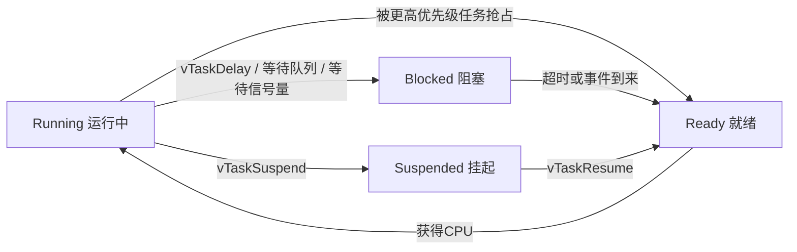
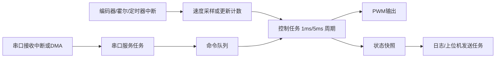

## FreeRTOS解决什么问题

写裸机程序时，最常见的写法是一个 `while(1)` 大循环，里面轮询按键、串口、传感器和控制逻辑。功能少的时候，这样写很直接；功能一多，问题也会跟着冒出来：

- 某个模块一旦阻塞，别的模块就全卡住
- 定时关系越来越乱，靠 `HAL_Delay()` 很难把系统节奏控稳
- 中断里放太多逻辑，调试困难，系统行为也不稳定
- 模块之间互相“抢变量”，后期很容易出现偶发 bug

FreeRTOS 的核心作用，不是“让程序更高级”，而是**把多个并发任务组织起来**。它提供了一套调度机制和同步原语，让系统知道：

- 现在该运行谁
- 谁该先运行
- 谁该等待事件
- 谁在共享资源时需要保护

如果把 MCU 工程看成一个小型工厂，那么中断更像“紧急铃声”，只负责快速通知；真正的业务处理，应该交给任务去做。FreeRTOS 干的就是这个调度工作。

不过也别反过来神化 RTOS。若工程只有几个简单状态机、没有明显并发需求、实时性也不复杂，裸机反而更轻。**RTOS 不是默认答案，它是在系统复杂度上来之后，帮你把工程重新拉回可控状态的工具。**

## FreeRTOS运行时到底在发生什么

### 任务是基本执行单元

在 FreeRTOS 里，程序不是只有一个主循环，而是由多个任务组成。每个任务本质上都是一个死循环函数，例如：

```c
void LedTask(void *argument)
{
    for (;;)
    {
        ToggleLed();
        vTaskDelay(pdMS_TO_TICKS(500));
    }
}
```

你可以把任务理解成“逻辑线程”，但它不是桌面操作系统里那种重量级线程。它没有虚拟内存，也没有复杂的进程隔离机制，核心目标只有一个：**在资源极其有限的 MCU 上完成可预测的任务切换。**

### 调度器负责决定谁运行

FreeRTOS 启动后，调度器开始接管 CPU。它会在可运行任务中，优先选择**优先级最高**的那个。

调度器通常基于下面几件事触发切换：

- 一个更高优先级任务变为就绪态
- 当前任务主动延时或阻塞
- 一个中断唤醒了更高优先级任务
- 时间片轮转触发同优先级任务切换

### 任务状态

理解 FreeRTOS，最关键的是先把任务状态分清楚。



- `Running`：当前占用 CPU 的任务
- `Ready`：已经准备好，只是暂时没轮到
- `Blocked`：在等时间、等队列、等信号量、等事件
- `Suspended`：被显式挂起，不参与调度

很多初学者会误以为“任务切换 = 多个任务同时跑”。其实单核 MCU 上任意时刻只有一个任务真正运行，所谓并发，本质上是**快速切换带来的执行交错**。

### Tick节拍是调度器的时钟

FreeRTOS 通常依赖一个固定频率的系统 Tick 中断，例如 1 kHz，也就是 1 ms 一拍。这个 Tick 用来：

- 给延时计时
- 推进软件定时器
- 触发时间片轮转

Tick 不是越快越好。频率太高会增加中断和调度开销，频率太低又会降低时间分辨率。工程里常见配置是 `1000 Hz`，也就是 1 ms 精度，够用且直观。

## FreeRTOS里几类最重要的组件

FreeRTOS 真正常用的东西并不多，最核心的是下面这些：

| 组件 | 主要用途 | 典型场景 |
| --- | --- | --- |
| 任务 Task | 承载独立执行逻辑 | 控制任务、通信任务、日志任务 |
| 队列 Queue | 传数据 | 命令下发、传感器消息、事件对象 |
| 二值信号量 Binary Semaphore | 发事件 | ISR 唤醒任务 |
| 计数信号量 Counting Semaphore | 计数资源或累计事件 | 多缓冲区块管理 |
| 互斥锁 Mutex | 保护共享资源 | 共享串口、共享 I2C |
| 事件组 Event Group | 多条件同步 | 初始化完成、状态组合等待 |
| 任务通知 Task Notification | 轻量级单任务通知 | 高频 ISR 唤醒 |
| 软件定时器 Software Timer | 中低频定时逻辑 | 心跳、超时管理 |

这些组件名字容易混，但可以先按一句话来记：

- **要传数据，用队列**
- **要发事件，用信号量或任务通知**
- **要保护共享资源，用互斥锁**

后面把 PID 工程搭起来时，基本就在用这三类思路。

## 一个FreeRTOS工程通常怎么组织

比较稳妥的思路是先分清三层：

1. **中断层**：只采样、搬运、置标志、发通知，尽快退出
2. **驱动/服务层任务**：负责串口接收解析、传感器采集、电机控制、日志输出等
3. **业务层任务**：负责状态机、控制策略、通信协议、系统模式切换

例如一个小车或控制板工程，常见拆法是：

- 串口接收任务
- 控制任务
- 显示任务
- 日志任务
- 看门狗喂狗任务

这样分的关键不是“多建几个任务显得专业”，而是**每个任务只对一类时序负责**。谁负责周期控制，谁负责异步事件处理，谁负责输出，都要清楚。

如果你在做串口接收，前面的 [stdio结合串口收发](./usart.md) 可以和这里一起看。串口中断或 DMA 解决的是“字节怎么进来”，FreeRTOS 解决的是“数据进来以后，谁来处理，怎么和别的模块配合”。

## 任务创建与调度，放到工程里该怎么理解

最常见的任务创建方式是 `xTaskCreate()`：

```c
BaseType_t xTaskCreate(
    TaskFunction_t pxTaskCode,
    const char * const pcName,
    const configSTACK_DEPTH_TYPE uxStackDepth,
    void * const pvParameters,
    UBaseType_t uxPriority,
    TaskHandle_t * const pxCreatedTask
);
```

真正容易踩坑的是这两个参数：

- `uxStackDepth`：任务栈大小，不是简单的“拍脑袋给个数”
- `uxPriority`：优先级越大，调度优先权越高，但不是越高越好

高优先级的含义是：**这个任务一旦就绪，就应该尽快运行。**  
因此只有真正对延迟敏感的逻辑才该给高优先级，比如控制闭环、关键采样、某些实时通信处理。日志、打印、界面刷新这类工作，优先级应该低一些。

另外，好的任务应该主动阻塞，而不是一直空转等系统来切。  
下面这两段代码，功能接近，但工程质量差很多。

不推荐的忙等写法：

```c
for (;;)
{
    if (uart_rx_flag)
    {
        ProcessUartData();
        uart_rx_flag = 0;
    }
}
```

更好的阻塞式写法：

```c
for (;;)
{
    if (xSemaphoreTake(uartRxSem, portMAX_DELAY) == pdTRUE)
    {
        ProcessUartData();
    }
}
```

前者会一直空转占 CPU，后者在没事时直接睡眠，事件来了再干活。这一点是 RTOS 编程和裸机轮询思路最大的分水岭。

## 把这些概念落到一个PID控制器上

前面这些介绍如果只停在 API 层，还是容易觉得抽象。  
所以后面不再从 `LED Task` 这种例子讲，而是把问题收紧到一个更像实际工程的场景：

单看 FreeRTOS 的 API，任务、队列、信号量、互斥锁都不难背。真正容易乱掉的地方，是一上工程就不知道这些东西该落在哪。  
**用 FreeRTOS 搭一个电机速度 PID 控制器。**

这个系统里至少会有下面几件事同时发生：

- 编码器或霍尔传感器在给速度反馈
- 控制器要按固定周期计算 PID
- 串口要接收上位机下发的目标转速和参数
- 调试口要打印当前速度、占空比、误差
- 系统可能还有故障保护、看门狗、状态机

如果用裸机大循环硬堆，功能少时还能扛，功能一多就会出现这些问题：

- 控制周期开始飘，PID 算法不再按固定采样时间运行
- 串口解析和控制计算互相打断
- 中断里塞太多逻辑，系统行为越来越不可预测
- 多个模块同时改控制参数，最后谁写进去的值都说不清

FreeRTOS 的价值，就在这里。它不是帮你“写得更高级”，而是帮你把控制器周围那些并发事务分开，让系统重新变得可管、可扩展、可调试。

如果你对 PID 本身还不熟，可以先看 [了解PID控制](../Miscellaneous/PID.md)。如果后面控制对象从有刷电机走到 BLDC 或 FOC，再接着看 [FOC和SVPWM的作用](../Math/motorControl.md)。

## 系统目标

假设我们要做的是一个简单的速度环：

- 目标量：目标转速 `target_speed`
- 反馈量：当前转速 `measured_speed`
- 控制输出：PWM 占空比或目标电压

离散 PID 的常见写法可以记成：

$$
u(k)=K_p e(k)+K_i \sum e(k)\Delta t + K_d \frac{e(k)-e(k-1)}{\Delta t}
$$

这里最关键的不是公式本身，而是这句：

**PID 必须建立在稳定的采样周期上。**

如果你号称每 `1 ms` 算一次 PID，但实际上有时 `1 ms`、有时 `4 ms`、有时又被串口打印拖成 `7 ms`，那你调的就不是同一个控制器了。

所以在 FreeRTOS 里，第一件事不是“先建几个任务”，而是先把这条主线定下来：

1. 谁负责提供速度反馈
2. 谁负责定周期执行 PID
3. 谁能改目标值和参数
4. 谁负责输出日志

这四件事分清，后面的组件选择就顺了。

## 一个合理的FreeRTOS结构

针对这个 PID 控制器，一个比较稳的拆法是：



对应的职责可以这样划分：

- **中断层**：只做采样、计数、搬运、唤醒，尽快退出
- **控制任务**：按固定周期计算 PID，它是控制状态的唯一拥有者
- **串口服务任务**：收命令、解析协议、更新目标值
- **日志任务**：低优先级输出调试信息，不打扰控制环

这套拆法的中心思想只有一句：

**控制器状态只让控制任务自己维护。**

也就是说，积分项、上一次误差、输出限幅状态这些变量，不要让串口任务、中断、别的业务任务都来碰。  
谁负责闭环，谁就独占这些状态。

## FreeRTOS在这里到底解决了什么

### 1. 它让控制周期稳定

控制任务可以用 `vTaskDelayUntil()` 按固定节拍运行：

```c
void ControlTask(void *argument)
{
    TickType_t lastWakeTime = xTaskGetTickCount();

    for (;;)
    {
        RunPidLoop();
        vTaskDelayUntil(&lastWakeTime, pdMS_TO_TICKS(1));
    }
}
```

这里比 `vTaskDelay()` 更合适，因为 `vTaskDelayUntil()` 是按节拍对齐的。  
对于 PID 这种依赖采样时间的算法，这是最基本的工程要求。

### 2. 它让异步事务不再乱入控制环

串口命令的到来是异步的，日志输出也可能很慢。  
FreeRTOS 可以把这些非周期事务和控制任务分开：

- 串口任务等数据，来了再处理
- 日志任务低优先级慢慢发
- 控制任务只按周期跑自己的计算

这样你就不会为了打印一串调试信息，把速度环抖坏。

### 3. 它让共享资源有清楚的边界

如果多个任务都要用同一个串口、同一个 I2C、同一个配置结构体，就不能再靠“大家自觉点别撞上”。  
FreeRTOS 里的互斥锁、队列、事件组，本质上是在帮你建立秩序。

## 任务怎么建，优先级怎么排

### 任务不是越多越好

对于这个 PID 控制器，通常不需要“一个函数一个任务”。  
更实用的做法是只保留真正有独立时序的任务。

一个常见组合是：

- `ControlTask`：控制周期任务，高优先级
- `UartServiceTask`：命令接收与解析，中优先级
- `LogTask`：日志输出，低优先级
- `ProtectTask`：故障监控或看门狗，中优先级或低优先级

### 优先级的基本思路

优先级不是按“谁重要”拍脑袋，而是按“谁最怕延迟”来排。

对速度 PID 来说：

- **控制任务** 最怕延迟，因为它直接决定闭环周期
- **串口任务** 允许稍慢，只要别长时间积压
- **日志任务** 最不怕慢，它只是辅助观测

因此通常会是：

- 控制任务：高优先级
- 串口服务任务：中优先级
- 日志任务：低优先级

但高优先级任务也不能写成死循环硬跑。它必须在每轮计算后阻塞或延时，让系统有机会调度其他任务。

### 任务创建

```c
TaskHandle_t controlTaskHandle = NULL;
TaskHandle_t uartTaskHandle = NULL;
TaskHandle_t logTaskHandle = NULL;

void AppTaskCreate(void)
{
    xTaskCreate(ControlTask, "control", 512, NULL, 4, &controlTaskHandle);
    xTaskCreate(UartServiceTask, "uart", 512, NULL, 3, &uartTaskHandle);
    xTaskCreate(LogTask, "log", 512, NULL, 1, &logTaskHandle);
}
```

栈大小不要盲猜。像 `printf`、浮点格式化、局部大数组，都会把栈吃得很快。调试阶段要配合 `uxTaskGetStackHighWaterMark()` 看余量。

## 一个PID控制器里常见的数据流

先把数据流想清楚，再决定用哪个 FreeRTOS 组件。

### 哪些数据是周期的

这些通常由控制任务自己消化：

- 当前速度
- 当前误差
- 积分累计值
- 上一次误差
- 当前输出占空比

这些变量不需要到处共享，更不应该让外部任务直接改。  
它们应该是控制任务的私有状态。

### 哪些数据是异步命令

这些适合从别的任务送进控制任务：

- 新的目标转速
- 新的 `Kp / Ki / Kd`
- 启停命令
- 模式切换命令

这类数据最适合走**队列**。

### 哪些数据只是事件通知

这些适合用**信号量**或**任务通知**：

- DMA 收到一包数据
- 编码器采样窗口结束
- 某个故障标志触发

如果只是“告诉别人该醒了”，那就不要滥用队列。

## 队列：把目标值和命令送给控制任务

对于 PID 控制器，队列最常见的用途是传命令。

```c
typedef enum
{
    CMD_SET_TARGET_SPEED = 0,
    CMD_SET_PID_PARAM,
    CMD_ENABLE_MOTOR,
    CMD_DISABLE_MOTOR
} ControlCmdType_t;

typedef struct
{
    ControlCmdType_t type;
    float value1;
    float value2;
    float value3;
} ControlCmd_t;
```

创建队列：

```c
QueueHandle_t controlCmdQueue = NULL;

void AppObjectCreate(void)
{
    controlCmdQueue = xQueueCreate(8, sizeof(ControlCmd_t));
}
```

串口服务任务解析完成后，把命令发给控制任务：

```c
void UartServiceTask(void *argument)
{
    ControlCmd_t cmd;

    for (;;)
    {
        if (WaitAndParseUartCommand(&cmd))
        {
            xQueueSend(controlCmdQueue, &cmd, pdMS_TO_TICKS(10));
        }
    }
}
```

控制任务每个周期把积压命令清掉：

```c
static float targetSpeed = 0.0f;
static float kp = 1.0f;
static float ki = 0.1f;
static float kd = 0.0f;

static void ApplyControlCommand(const ControlCmd_t *cmd)
{
    switch (cmd->type)
    {
    case CMD_SET_TARGET_SPEED:
        targetSpeed = cmd->value1;
        break;

    case CMD_SET_PID_PARAM:
        kp = cmd->value1;
        ki = cmd->value2;
        kd = cmd->value3;
        break;

    case CMD_ENABLE_MOTOR:
        MotorEnable();
        break;

    case CMD_DISABLE_MOTOR:
        MotorDisable();
        break;

    default:
        break;
    }
}
```

这种做法的好处是，参数更新点非常清楚。  
不是谁都能随时去改 `kp`、`ki`、`kd`，而是统一在控制任务里落地。

## 信号量：让中断只负责叫醒，不负责计算

### 中断里不要直接算PID

这条规则最好一开始就立住。  
中断里可以做的事包括：

- 读取编码器计数
- 取一批 ADC 结果
- 判断 DMA 是否收满
- 清中断标志
- 发一个 `FromISR` 通知

但不要在中断里直接做这些：

- 协议解析
- 浮点 PID 计算
- 大段日志打印
- 长时间循环

中断的职责是“快”，不是“完整”。

### 二值信号量的典型用法

假设你用 DMA + 空闲中断收串口，那么 ISR 里只发通知：

```c
SemaphoreHandle_t uartRxSem = NULL;

void AppSyncCreate(void)
{
    uartRxSem = xSemaphoreCreateBinary();
}

void USARTx_IRQHandler(void)
{
    BaseType_t xHigherPriorityTaskWoken = pdFALSE;

    if (UartIdleDetected())
    {
        xSemaphoreGiveFromISR(uartRxSem, &xHigherPriorityTaskWoken);
        portYIELD_FROM_ISR(xHigherPriorityTaskWoken);
    }
}
```

任务里再去拿完整数据、做协议解析：

```c
void UartServiceTask(void *argument)
{
    for (;;)
    {
        if (xSemaphoreTake(uartRxSem, portMAX_DELAY) == pdTRUE)
        {
            UartFetchAndParseFrame();
        }
    }
}
```

如果你前面已经按 [stdio结合串口收发](./usart.md) 配好了串口中断或 DMA，这里要补上的，不是新的驱动代码，而是“中断和任务之间的交接方式”。

### 任务通知更轻

如果只是固定唤醒某一个任务，任务通知比信号量更轻。  
例如编码器采样窗口结束后，直接通知控制任务：

```c
vTaskNotifyGiveFromISR(controlTaskHandle, &xHigherPriorityTaskWoken);
```

然后控制任务里：

```c
ulTaskNotifyTake(pdTRUE, portMAX_DELAY);
```

这类用法很适合对时延比较敏感的控制链路。

## 互斥锁：保护共享串口和共享配置

在 PID 工程里，互斥锁最常见的两个使用点是：

- 多个任务共用一个调试串口
- 多个任务读写同一个配置块

### 为什么不用信号量替代互斥锁

因为互斥锁有优先级继承。  
比如：

- 控制任务优先级高
- 日志任务优先级低
- 日志任务先拿了串口锁，正在发送字符串

这时控制任务如果也来打印，而没有优先级继承，中优先级任务就可能把日志任务卡住，最终反过来拖高优先级控制任务。这就是优先级反转。

互斥锁是专门用来解决共享资源访问问题的，所以：

- **保护资源，用 Mutex**
- **通知事件，用 Semaphore 或 Task Notification**

别混。

## 调度为什么会直接影响PID效果

很多人把 RTOS 只当系统框架，但对控制器来说，调度策略本身就会影响控制效果。

### 1. 采样周期不稳会直接改写控制器

积分项和微分项都依赖 `dt`。  
如果控制任务的运行间隔不稳定：

- 积分项可能忽大忽小
- 微分项会更敏感，噪声和抖动会被放大

所以 PID 控制任务最好满足两点：

- 周期固定
- 计算路径尽量短且稳定

### 2. 控制任务不要被低价值工作拖住

这些操作尽量别放在控制任务里：

- `printf`
- 字符串拼接
- 阻塞式串口发送
- 文件系统写入
- 长时间等待某个外设完成

控制任务最适合做的事只有这一条主线：

1. 读反馈
2. 更新控制命令
3. 算 PID
4. 输出 PWM

其他事情，都应该往外拆。

## 一个完整些的控制任务骨架

下面给一个更接近工程使用的骨架。

```c
typedef struct
{
    float kp;
    float ki;
    float kd;
    float integral;
    float prevError;
    float outMin;
    float outMax;
} PidController_t;

static PidController_t speedPid = {
    .kp = 1.0f,
    .ki = 0.1f,
    .kd = 0.0f,
    .integral = 0.0f,
    .prevError = 0.0f,
    .outMin = 0.0f,
    .outMax = 1000.0f,
};

static float targetSpeed = 0.0f;

static float PidStep(PidController_t *pid, float ref, float fb, float dt)
{
    float error = ref - fb;
    float derivative;
    float output;

    pid->integral += error * dt;

    derivative = (error - pid->prevError) / dt;
    output = pid->kp * error
           + pid->ki * pid->integral
           + pid->kd * derivative;

    if (output > pid->outMax)
    {
        output = pid->outMax;
    }
    else if (output < pid->outMin)
    {
        output = pid->outMin;
    }

    pid->prevError = error;
    return output;
}

void ControlTask(void *argument)
{
    TickType_t lastWakeTime = xTaskGetTickCount();
    const float dt = 0.001f;
    ControlCmd_t cmd;
    float measuredSpeed;
    float output;

    for (;;)
    {
        while (xQueueReceive(controlCmdQueue, &cmd, 0) == pdTRUE)
        {
            ApplyControlCommand(&cmd);
        }

        measuredSpeed = GetMotorSpeed();
        output = PidStep(&speedPid, targetSpeed, measuredSpeed, dt);
        MotorSetPwm(output);

        vTaskDelayUntil(&lastWakeTime, pdMS_TO_TICKS(1));
    }
}
```

这段代码的重点不是公式本身，而是工程边界：

- 目标值从队列来
- PID 内部状态只在控制任务里维护
- 控制周期固定
- 输出统一从控制任务写到 PWM

这才是 FreeRTOS 真正帮到控制器的地方。

## 事件组、计数信号量在这个场景里什么时候有用

### 事件组：适合系统启动条件同步

比如控制器启动前，你可能要求：

- 编码器初始化完成
- PWM 驱动初始化完成
- 串口通信建立完成

这时事件组很顺手：

```c
#define EVT_ENCODER_READY (1 << 0)
#define EVT_PWM_READY     (1 << 1)
#define EVT_UART_READY    (1 << 2)
```

控制任务启动后先等这些条件都满足，再进入闭环。

### 计数信号量：适合累计型事件

如果你在做的是更复杂的采样流水，比如：

- DMA 连续搬运采样块
- 一次控制需要消费多个采样块

那计数信号量会比二值信号量更合适，因为它能表示“积压了几个待处理事件”。

不过对于一个普通的速度 PID 控制器，最常用的仍然是：

- 队列
- 二值信号量
- 任务通知
- 互斥锁

## FreeRTOS里几个最容易把PID做坏的点

### 1. 控制任务里打印日志

这几乎是新手最容易犯的错。  
日志看着方便，但它会直接污染控制周期。

更好的做法是：

- 控制任务把关键状态写入一个轻量快照
- 日志任务低优先级去取快照并输出

### 2. 多个地方都能改PID参数

如果中断能改、串口任务能改、状态机也能改，最后系统行为会越来越难解释。  
参数更新最好统一走命令通道，在控制任务里集中生效。

### 3. 把编码器换算、滤波、协议解析都塞进同一个高优先级任务

控制任务应该短、稳、可预测。  
采样换算和轻量滤波可以放进来，但重型处理最好往外拆。

### 4. 忽略积分饱和和输出限幅

控制理论和工程实现之间，常常差在这一步。  
电机有最大电压、最大电流、最大 PWM 占空比，控制器一定要面对饱和。

如果你只记公式，不处理这些实际限制，系统很容易出现：

- 积分堆积
- 输出长时间打满
- 一解除饱和就剧烈过冲

所以 PID 本体之外，还得补工程保护，比如：

- 输出限幅
- 积分限幅
- 故障停机
- 目标值爬坡

### 5. 中断优先级配置不符合FreeRTOS要求

在 STM32 上，能调用 `FromISR` API 的中断优先级必须落在 FreeRTOS 允许范围内。  
这类问题不是“偶尔不优雅”，而是会直接导致系统行为诡异甚至崩掉。

## 什么时候不一定要上FreeRTOS

如果你的控制系统非常简单，例如：

- 只有一个速度环
- 参数固定
- 没有复杂通信
- 没有大量并发外设

那裸机定时器中断 + 主循环状态机也完全能做。

但只要系统开始往这些方向发展，RTOS 的价值就会越来越明显：

- 上位机通信更复杂
- 控制模式变多
- 日志和监控要求更高
- 要同时处理多个外设和保护逻辑

这时 FreeRTOS 真正提供的，不是“多线程的高级感”，而是**让 PID 控制器周围的事务重新变得有秩序**。

## 小结

把 FreeRTOS 落在一个 PID 控制器上看，很多概念会突然具体起来：

- **任务**：谁负责固定周期算控制，谁负责处理异步命令
- **调度**：为什么控制周期必须稳定，为什么优先级不能乱给
- **队列**：目标值和参数该怎么安全送进控制器
- **信号量/任务通知**：中断怎么叫醒任务，而不是自己把活干完
- **互斥锁**：共享串口和共享配置怎么防止互相踩踏

最后再压一句核心原则：

**让控制任务只做控制，让中断只做通知，让外围事务围着控制器转，而不是反过来。**

只要这条线没丢，FreeRTOS 在控制工程里基本就不会用偏。
