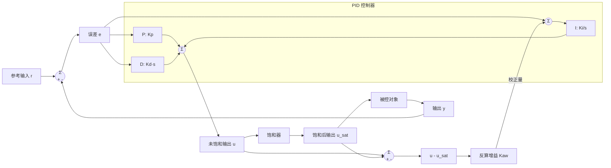

## 从积分饱和的成因到 anti-windup 的处理方法
### 系统的非线性

理想的 PID 推导通常默认执行器可以无限跟随指令，但工程里几乎从来不是这样。

最常见的问题就是**饱和**。电机有最大转速，电池有最大放电电流，功放有最大输出摆幅，阀门也只能开到头。控制器继续加指令，不代表系统还能继续给出更大的响应。

例如在 BLDC 驱动里，母线电压有限，电流采样带宽也有限。理论上的连续控制量，落到实际系统里，总会被这些硬约束截断。这类问题在 [FOC和SVPWM的作用](motorControl.md) 里也很常见。

### 引发的问题

麻烦通常出在积分项。

积分项的作用，是把过去一段时间的误差累计起来。只要误差一直存在，积分项就会一直增大。正常情况下这没有问题，因为它确实能把稳态误差慢慢压下去。

但如果执行器已经饱和了，系统实际上已经"出满力"了，这时误差虽然还在，积分器却不知道输出已经顶到上限，仍然会继续累加。于是控制器内部记下了一个很大的积分量，等到系统重新回到可控范围时，这个过大的积分项还会继续推着输出往饱和方向走一段时间。

这就是积分饱和，也常叫 **windup**。

它带来的典型现象有两个：

1. 明明误差已经开始变小，输出却还在顶着上限不肯下来。
2. 系统恢复自由后会出现明显过冲，甚至来回振荡，因为控制器需要先把之前"攒下来的积分债"慢慢吐掉。

所以问题不在于饱和本身，而在于控制器内部状态和执行器真实状态脱节了。外面已经到头，积分器还以为自己能继续施加作用。

### 实际例子

以让无人机升高到 50 m 为例。图中的紫线是误差，蓝线是控制器期望的电机转速，绿线是电机实际转速。

假设无人机起飞时被外力压住。高度始终上不去，位置误差一直存在，于是 PID 会不断提高电机的目标转速，想用更大的升力把它拉起来。

问题是电机转速有上限。假设极限是 1000 rpm，那么电机到了 1000 rpm 以后，控制器再怎么加指令，实际转速也不会更高。可在这段时间里，误差还没消失，积分器还在继续累加，所以蓝线会继续往上走，可能到 1200 rpm，1500 rpm，甚至更高；绿线却早就卡在 1000 rpm 不动了。

如果这时外力突然消失，无人机会立刻用满转速向上冲。等高度超过 50 m 以后，误差变成反向，控制器开始要求减速，但它减的是蓝线这个"内部期望值"，不是已经被卡死在上限的绿线。于是蓝线虽然开始下降，短时间内仍然高于真实所需转速，电机还是会继续以过大的推力工作，无人机就会明显冲过头。

蓝线和绿线之间的差距，可以理解为**控制器想要但执行器给不出来的那一部分输出**。这部分差值越大，说明积分器在饱和区里积累得越厉害，后面释放出来的过冲通常也越重。

### 保护手段

#### Clamping钳位

最直接的方法是钳位，或者说积分分离。

做法很朴素：当控制量已经饱和，并且当前误差还在推动输出继续往饱和方向走时，暂停积分器的继续累加。这样可以避免系统明明已经顶到极限，积分项还在拼命往里灌。

换句话说：

1. 如果输出已经到上限，而误差还在让输出继续增大，就先别积。
2. 如果输出已经到下限，而误差还在让输出继续减小，也先别积。
3. 只有当误差方向有助于把输出从饱和区拉回来时，再恢复积分。

这种方法简单、便宜、好实现，很多嵌入式控制里都会先用它。

要注意的一点是，饱和判断阈值最好不要死死贴着物理极限。工程上通常会留一点余量，避免采样噪声、参数误差或瞬态尖峰把控制器反复推到边界附近抖动。

#### Back-calculation反馈校正

它的思路不是简单地把积分器关掉，而是把"饱和后的实际输出"反过来喂给积分器，告诉它：你算出来的值太大了，往回收一点。

结合 PID 框图看会更直观：

上面这张图里，P、I、D 三个子块放在同一个 PID 控制器框内。左侧求和点先算出误差 `e = r - y`，然后分别送到比例、积分、微分三个支路，最后在右侧求和点合成为控制器输出 `u`。

图中的求和点含义如下：

1. 最左侧求和点是 `+r` 和 `-y`，也就是标准负反馈。
2. 右下角求和点是 `+u` 和 `-u_sat`，算出来的是饱和前后之间的差值。
3. 积分支路前的求和点负责把误差和反算校正量一起送进积分器。

back-calculation 的关键在下面这条支路。控制器先算出未饱和输出 `u`，饱和器再把它裁剪成执行器真正能给出的 `u_sat`。两者的差 `u - u_sat`，就是"控制器想要但执行器做不到"的那部分输出。

更具体一点：

1. 控制器先算出一个未饱和的输出值。
2. 执行器再把这个值裁剪到实际上限或下限。
3. 用"未饱和输出 - 饱和后输出"这个差值，经过一个校正系数后反馈到积分器。

如果控制器算出来 1500 rpm，但执行器最多只能给 1000 rpm，那么这 500 rpm 的差值就会被送回积分通道，促使积分项尽快减小。这样一来，积分器不会一直抱着那个不可能实现的目标不放。

和钳位相比，back-calculation 的特点是更平滑。它不是突然停掉积分，而是让积分项按一定速度回到合理范围。所以在一些对动态过程更敏感的场合，它通常比简单钳位更自然。

`Kaw` 决定这条反算支路把积分项往回拉的速度。太小了，windup 消得慢；太大了，又可能把系统拉得过急，带来额外振荡。

### 参考链接

[Anti-windup for PID control | Understanding PID Control, Part 2](https://www.youtube.com/watch?v=NVLXCwc8HzM)
