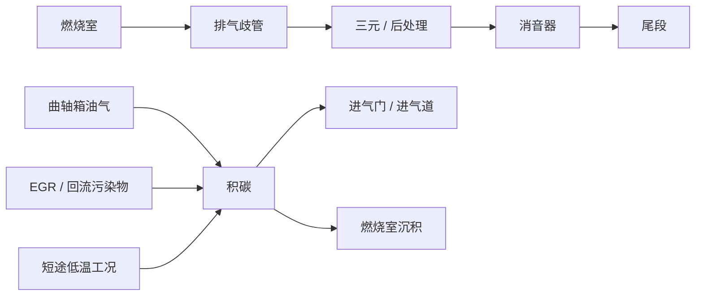

# 排气系统不是尾段声浪件

很多人第一次注意排气系统，往往是因为声音，或者因为改装车的尾段样式。但从结构角度看，排气系统真正重要的地方，根本不在外观，而在它是发动机呼吸过程的后半段。

发动机每完成一次燃烧，都得把废气及时排出去。排得不顺，下一轮进气就会受影响；热量带不走，零部件寿命和后处理效率就会一起承压；流动组织乱了，低中高转的表现也可能前后失衡。

所以排气系统不是挂在车尾的附属件，它和 [动力总成](./Powertrain.md) 是前后连在一起的一整件事。

## 排气与积碳关系图

## 一个够用的热量视角

如果只想抓住排气系统最朴素的物理图景，可以记住：

$$
\dot Q \approx \dot m c_p \Delta T
$$

它不用于细算标定，只是提醒你：排气系统一直在搬运高温废气带来的热量。流量、温差和散热路径一变，后处理负荷、周边老化和长期状态都会跟着变。

## 排气系统的基本组成

一套典型燃油车排气系统，通常会包括这些部分：

- 排气歧管
- 三元催化器或其他后处理装置
- 中段管路
- 消音器
- 尾段

从外面看，这些东西像是一条管路。从工程角度看，它其实同时在处理四件事：气流、热量、噪声和排放。

### 排气歧管先决定了“怎么吐气”

排气歧管离燃烧室最近，它最先接住高温高压废气。歧管长度、截面和汇流方式，都会影响脉冲干涉和扫气效果。设计合理时，它能帮发动机更顺畅地把上一轮废气推出去；设计不匹配时，低中高转的输出特性就可能顾此失彼。

### 后处理不是“环保附件”

三元催化器、颗粒捕集器这类后处理装置，常被误会成只为法规存在。实际上，它们会真实影响热管理、背压和响应特性。工程师做的从来不是“先让车有劲，再额外挂个净化器”，而是从一开始就把性能、排放和热负荷一起算进去。

## 背压到底是不是越小越好

“排气越通越有劲”这句话，最多只能算说对一半。高转大流量工况下，过大的排气阻力当然不好；但如果一味追求低背压，把整个系统做得过于空旷，低中转的脉冲利用和气流速度又可能被破坏。

结果会怎样？很常见：高转好像畅快了一点，低转扭矩却开始发空，油门跟脚性也未必更好。

所以判断排气系统，关键不是“通不通”，而是它和发动机排量、配气特性、目标转速区间是否匹配。排气不是越少约束越强，而是要在不同工况里找到合适的阻力和脉冲组织。

## 热管理往往比声浪更要命

排气系统工作环境极端，高温是常态。热如果处理不好，后果远不止“舱内更热一点”。

- 歧管附近部件会承受更高热辐射
- 催化器和颗粒捕集器会更容易进入高负荷区
- 长期高温会加快橡胶件、线束和隔热材料老化

所以很多原厂排气看起来没那么“暴力”，却会有复杂的隔热层、导流设计和支架布置。这不是保守，而是为了让整车在长期使用里不掉链子。

## 积碳从哪里来

积碳不是某一个瞬间突然长出来的，它更像长期燃烧状态、机油蒸汽和热环境共同留下的痕迹。常见高发区域包括：

- 进气道
- 进气门背面
- 节气门
- 活塞顶部
- 燃烧室

它的来源通常不止一个：

- 燃烧不完全留下的沉积
- 曲轴箱通风带来的油气
- 废气再循环带来的颗粒和污染物
- 高温工况下的长期附着和结焦

所以积碳不是一个简单的“脏了”问题，而是发动机工作方式和使用习惯累出来的结果。

## 为什么直喷机更容易被拿来讨论积碳

进气歧管喷射发动机里，燃油会经过进气门背面，对门背和进气道有一定冲刷作用。缸内直喷发动机则不同，燃油直接喷进燃烧室，进气门失去了这层“顺手清洗”。

于是，只要曲轴箱通风来的油气、EGR 带来的污染物或者短途低温工况够多，进气门背面积碳就更容易积起来。直喷并不是一定更糟，它只是把这个问题暴露得更明显，也更依赖整体燃烧和通风管理。

## 积碳会带来什么

积碳的影响不是一下把车变成另一个样子，而是慢慢把很多边角变差：

- 冷启动抖动更明显
- 怠速变得不稳
- 油耗慢慢上升
- 油门响应变钝
- 爆震倾向和高温风险上升

这些表现看上去分散，其实都指向同一件事：混合气形成和燃烧条件不再像原来那么干净、可控。

## 怎么理解“排气”和“积碳”的关系

这两件事表面上看，一个在管废气怎么走，一个在讲发动机内部为什么会脏。其实它们有个共同核心：燃烧效率和热管理。

- 燃烧越充分，沉积倾向通常越低
- 排气流动和温度控制越合理，发动机越容易待在健康工况
- 长期短途、低温、低负荷、频繁拥堵，更容易让系统长时间停在不理想区间

所以排气和积碳，不该拆开看。一个决定废气怎么离开，一个反映这台发动机长期烧得怎么样。

## 日常使用里，什么习惯最容易把问题养出来

最典型的几种工况其实并不神秘：

- 长期短途，发动机没完全热透就熄火
- 长期低速拥堵，燃烧和后处理都难进入舒服区间
- 保养拖延，机油状态和通风系统状态变差
- 动力系统原厂匹配被大幅改动，但后续热管理和标定没跟上

这也是为什么有些车明明没什么硬伤，却在某些使用环境里更容易出现积碳和排气相关问题。机器本身是一方面，使用方式是另一方面。

## 这章最后该记住什么

### 第一，排气不是装饰件

它是发动机呼吸系统的后半段，直接影响流动、热量、噪声和排放。

### 第二，积碳不是一个孤立故障

它通常是喷射方式、燃烧状态、通风系统、使用工况和维护习惯一起累出来的结果。

### 第三，发动机要前后联看

理解发动机，不能只盯着进气、点火和马力曲线，也要看废气怎么排、热怎么走、长期状态怎么维持。前段负责把能量做出来，后段负责把代价处理掉。两边少看一边，理解都会断一截。
