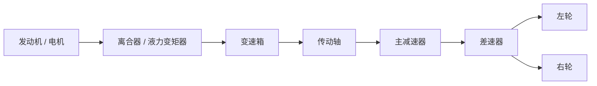

# 动力总成不是几个零件，而是一条扭矩通道

很多人聊车，开口先问多少匹马力。这个问题当然重要，但只看峰值马力，其实很难解释一台车为什么“起步猛”“中段虚”“高速后劲足”或者“开起来没精神”。真正把这些体感串起来的，不是一串参数，而是一整条扭矩传递链。

这条链从发动机开始，经过离合器或液力变矩器、变速箱、传动轴、主减速器、差速器，最后落到左右车轮。任何一个环节变了，驾驶感受都会跟着变。理解动力总成，重点不是把零件表背熟，而是看清扭矩如何被制造、放大、分配和消耗。

## 传力速记图

## 关键关系式

$$
P = T \omega
$$

$$
T_w = T_e \cdot i_g \cdot i_0 \cdot \eta
$$

$$
F_x = \frac{T_w}{r}
$$

这里 `$T_e$` 是发动机输出扭矩，`$i_g$` 是变速箱传动比，`$i_0$` 是主减速比，`$\eta$` 是传动效率，`$r$` 是轮胎有效滚动半径。复习时只要抓住这一组关系，就能把“发动机参数”和“轮端推力”连起来。

## 发动机：真正被驾驶者感受到的是扭矩曲线

发动机先做一件最基础的事：把燃料的化学能变成曲轴的旋转扭矩。只是这份扭矩并不是在所有转速下都一样大。于是，驾驶者感受到的“有劲没劲”，说到底是扭矩曲线在起作用。

- 扭矩决定拧动传动系统的能力
- 功率决定单位时间里做功有多快
- 在同一挡位下，低转响应、中段再加速和高转延展性，背后都是扭矩与转速的组合

所以判断一台发动机，不能只看峰值。峰值像考试最高分，曲线才像平时成绩。车日常好不好开，往往更取决于常用转速区间里有没有一段宽而稳定的扭矩平台。

### 四冲程循环在做什么

进气、压缩、做功、排气，这四个词很多人早就背过，但如果不把它们和车辆表现挂起来，很容易觉得只是课本内容。

其实四冲程循环直接决定三个现实问题：

1. 低转能不能饱满，取决于进气效率和燃烧稳定性。
2. 高转能不能继续拉，取决于进排气阻力、配气机构能力和机械损失。
3. 油耗、积碳和热负荷是否容易失控，取决于混合气形成和燃烧是否干净。

这也是为什么 [排气系统](./Exhaust_and_Deposits.md) 从来不是发动机后面随便接一根管子。发动机把气吐出去，排气系统又反过来影响它下一轮怎么“吸气”和“呼气”。

### 涡轮、自然吸气和主观动力感

自然吸气发动机的好处，通常是响应直接，输出建立过程比较线性。你踩多少，往往就给多少。缺点也明显：想要更大功率，就得靠排量、转速和充气效率硬堆。

涡轮增压发动机换了条路。它把废气能量再利用，用增压空气提高进气量，于是同排量更容易做出更高扭矩。代价是响应链路更长，热管理更复杂，标定和机械匹配稍差一点，驾驶者就会感觉迟滞、突兀或者高温下掉状态。

两者没有绝对高下，更多是取向不同。自然吸气像线性工具，涡轮像放大器。关键不是谁更高级，而是谁更适合目标用途。

## 变速箱为什么决定车辆性格

发动机并不喜欢在所有车速下都工作。它总有自己的甜区: 太低转没劲，太高转损失大，甚至容易过热。变速箱存在的意义，就是让发动机更常待在它擅长的位置。

说得再直白一点，发动机负责“产扭矩”，变速箱负责“翻译扭矩”。同一台发动机，搭不同齿比和换挡逻辑，车的性格能差很多。

### 手动变速箱

手动变速箱结构直观，驾驶者也最能直接感受到动力链的断开、结合和再输出。它的关键部件包括：

- 离合器，用来接通或切断发动机和变速箱
- 同步器，用来让待啮合齿轮的转速尽快接近
- 拨叉和换挡机构，用来完成挡位选择
- 齿轮组，用来提供不同传动比

手动挡的优点，在于效率高、机械感清楚、驾驶参与度强。缺点也很实际：走走停停费神，换挡品质高度依赖驾驶者动作。

### AT 自动变速箱

传统 AT 的核心是液力变矩器加行星齿轮组。液力变矩器让起步更柔和，也能在一定工况下放大扭矩；行星齿轮组则在有限空间里实现多个挡位组合。

AT 的强项，是平顺性和工况覆盖面。城市跟车、坡道起步、低速蠕行，这些场景它通常比手动和部分双离合更从容。代价是结构复杂、控制逻辑重、能量损失一般也更高一些。

### CVT 无级变速箱

CVT 的思路很直接：不给你一挡二挡三挡，而是在一段连续范围里改变传动比。这样一来，发动机更容易长期待在高效率区或者高功率区。

它的优点，是巡航油耗和动力维持往往比较顺。问题也很明确：扭矩承载能力、热稳定性和主观驾驶感不容易两全。很多人不喜欢 CVT，并不是它跑不动，而是它把加速感和转速感之间的传统关系打散了。

### 双离合变速箱

双离合可以理解成两套手动变速器并排工作。一套管奇数挡，一套管偶数挡，当前挡位还在输出时，下一挡已经提前待命。

它的长处，是传动效率高、换挡快、动力中断短。短板也很集中：低速频繁结合时热管理更难，控制做不好就容易顿挫、抖动，甚至影响耐久。

所以双离合并不是“天生运动”，而是“潜力很高，但更吃匹配”。

## 主减速器和传动轴：容易被忽略，却总在默默定调

发动机和变速箱聊得多，主减速器和传动轴聊得少，但它们并不只是陪衬。

主减速器负责做最后一次减速增扭。它和变速箱齿比一起，决定轮端最终拿到多大的扭矩。很多车型明明发动机一样，开起来却一个显得轻快、一个显得沉稳，差别常常就在齿比组合和主减速比上。

传动轴的任务则是把动力稳稳送过去。对于前置后驱或四驱车型，它不仅要传递扭矩，还要在角度变化、车身振动和高速旋转之间保持平衡。只要动平衡、支撑或万向节状态出问题，高速振动和异响通常马上就会找上门。

## 差速器为什么既重要又容易被误解

车辆转弯时，左右车轮走过的轨迹长度不同，所以转速也必须不同。差速器的基本工作，就是允许这种转速差存在，同时继续把动力送到两侧车轮。

开放式差速器的优点是结构简单、日常平顺，但它有个老问题：一旦一侧车轮附着很低，动力容易从更轻松打滑的那一边流走。于是就有了限滑差速器、电子限滑、扭矩矢量等方案。

这里最容易产生误解的地方在于：很多人把差速器当成“抓地的决定者”。实际上，它只能决定扭矩怎么分，能不能把这份扭矩变成有效驱动力，还得看 [轮胎抓地](./Tire_and_Wheel.md#轮胎不是黑色橡胶圈那么简单) 和 [悬架贴地能力](./Suspension.md#悬架到底在解决什么问题)。

差速器解决的是“怎么分”，不是“分出去的一定能用”。

## 前驱、后驱和四驱，差别到底落在哪里

驱动形式不是标签，它会直接改写动力怎么落地。

- 前驱把动力、转向和大部分前轴载荷放在一起，结构紧凑，成本低，日常稳定性也好，但前轮任务太多，极限时容易先推头。
- 后驱把驱动和转向职责分开，前轮更专心负责指向，后轮更专心负责推进，所以操控上更容易做出清晰的前后分工。
- 四驱把问题再往前推一步：既要抓地更强，也要分配更聪明，于是结构、重量和控制复杂度都会一起上升。

这三种形式没有谁天然更好，只是目标不同。家用、性能、越野，各自要的东西本来就不一样。

## 学动力总成，最后要留下哪几个判断标准

读完动力总成这一章，最值得留下的是这几个判断习惯。

### 先看曲线，再看峰值

峰值参数能说明上限，曲线才能说明这台车平时怎么发力。

### 先看轮端，再看发动机

发动机输出再漂亮，也要经过齿比、差速器和轮胎才会变成加速度。只有轮胎把力传到地面，动力才算真正成立。所以动力总成不能脱离 [轮胎与轮圈](./Tire_and_Wheel.md) 单独评价。

### 先看匹配，再看单件优劣

发动机、变速箱、主减速器和驱动形式是一整套匹配关系。单看某个部件“先进不先进”，意义往往不大。真正决定驾驶体验的，是它们放在一起之后有没有把各自优点接住。
