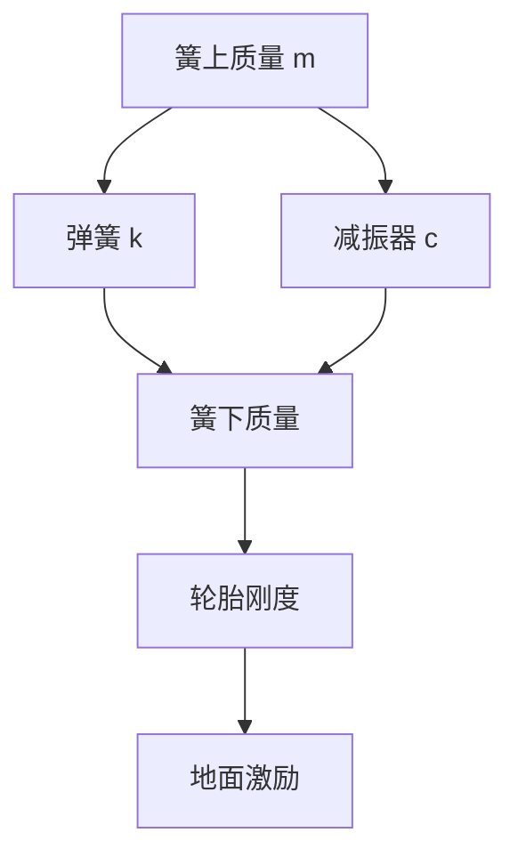

# 悬架到底在解决什么问题

很多人一提悬架，第一反应就是“这车偏软”或者“那车偏硬”。这种说法不算错，但只说到了一层表皮。悬架真正面对的问题，比软硬复杂得多。它既要让车身别太颠，又要让轮胎别离地；既要允许车轮上下运动，又要控制车身俯仰和侧倾；既要留住舒适性，还要留住转向和制动时的支撑感。

说到底，悬架是在做一件很难两全的事：一边照顾车身，一边照顾轮胎。车身希望世界安静一点，轮胎却必须尽量诚实地跟着地面起伏走。悬架就在这两者之间协调。

## 四分之一车模型速记图

## 关键关系式

$$
f_n = \frac{1}{2\pi}\sqrt{\frac{k}{m}}
$$

$$
\zeta = \frac{c}{2\sqrt{km}}
$$

第一式对应悬架的固有频率，第二式对应阻尼比。复习时不用死抠推导，只要记住：弹簧刚度 `$k$` 越大、簧上质量 `$m$` 越小，系统偏频通常越高；阻尼 `$c$` 决定它收不收得住。

## 悬架由哪些基础部件构成

先把角色分清楚，后面的调校逻辑才会顺。

### 弹簧：负责支撑，不负责止振

弹簧承担车身重量，也决定静态车高和一部分垂向刚度。螺旋弹簧最常见，板簧多见于载重和商用场景，空气弹簧则更适合需要高度调节和多工况兼顾的车型。

弹簧的作用可以理解得很朴素：它让车轮遇到路面起伏时，不至于把冲击原封不动塞给车身。但如果只有弹簧，没有别的约束，车身会像弹球一样上下反复晃。

### 减振器：负责把多余动作收住

减振器并不会支撑车重，它做的是另一件事：把弹簧来回振荡的能量尽快耗掉。内部油液通过阀系流动时会产生阻尼，机械能就在这个过程中转成热。

所以减振器不是“越硬越高级”。阻尼过小，车身会晃；阻尼过大，轮胎会来不及跟地面起伏，抓地反而丢得更快。优秀的减振器不是单纯强，而是知道什么时候该放，什么时候该收。

### 防倾杆、连杆和导向机构

弹簧和减振器负责垂向动作，连杆和导向机构则在决定车轮“怎么动”。它们控制车轮上下跳动时的外倾、前束、轮距变化，也决定侧倾时左右轮怎么分工。

防倾杆的作用，则是限制左右悬架在弯中出现过大的相对位移。它能帮你压住车身侧倾，但也可能在单侧颠簸时让另一边车轮跟着受影响。所以防倾杆也不是越粗越好，依旧要看工况和整体匹配。

### 衬套：最容易被忽略，却最容易影响质感

橡胶衬套不像减振器那样有存在感，但它经常决定一台车到底是“整”还是“散”。衬套负责给连杆连接点留出一定柔度，用来过滤高频振动，也用来管理受力后的弹性位移。

这类部件老化后，驾驶者最先感受到的往往不是某个零件坏了，而是底盘变松、转向不干净、刹车点头多了、过坎的余振也长了。

## 常见悬架结构，重点差在哪里

悬架形式很多，但真正值得关心的，不是名字听起来是否高级，而是它在空间、成本、轮胎控制能力和调校自由度之间怎么取舍。

### 麦弗逊

麦弗逊结构简单、占空间少、成本友好，所以前桥上非常常见。它的优点是布局高效，缺点是几何自由度有限，想在外倾控制、主销布置和空间包装之间同时做到很漂亮，难度不小。

### 双叉臂

双叉臂的优势，在于能更从容地管理车轮姿态变化，尤其是外倾控制和受力路径。它常见于对操稳、前桥精度和运动性能更看重的车型。代价也很明确：体积更大，结构更复杂，成本更高。

### 多连杆

多连杆的价值，是把功能拆细。不同连杆各自负责不同方向的约束，于是工程师能更精细地调几何和柔顺性。它的好处是上限高，缺点是调校复杂，零部件多，后期维护成本也更难压。

### 扭力梁和整体桥

这类非独立悬架经常被简单地说成“落后”，其实并不公平。它们在空间、耐久、载重和成本上有自己的优势。对很多家用车和商用车来说，这些优势非常现实。结构选择从来不是考试排名，而是目标函数不同。

## 悬架的 KC 特性是什么

KC 是 Kinematics and Compliance，翻成直白一点，就是“运动学和柔顺性”。它讨论的不是悬架名义上画成什么样，而是车轮真正上下跳、真正受力之后，会发生什么。

主要看两类事：

- 车轮跳动时，外倾、前束、轮距怎样变化
- 轮端受力后，衬套和连杆的弹性形变会带来哪些附加变化

这就是为什么两台车即便用了看起来相近的悬架形式，开起来依然能差很多。图纸上的几何只是起点，真正落到轮胎上的，是加载后的几何。

## 阻尼曲线比一句“偏硬”更有信息量

很多底盘评价停在“硬”和“软”，其实远远不够。更有用的看法，是去想这套减振器在不同速度区间里怎么工作。

- 低速阻尼更多影响车身姿态，比如转弯侧倾、刹车点头、加速抬头
- 高速阻尼更多影响过井盖、接缝和碎颠时的冲击感与贴地能力

如果一台车低速姿态控制得住、高速冲击又不生硬，说明它的阻尼区间划分和阀系设计很成熟。反过来，如果它一味靠大阻尼压住车身，短时间看似有支撑，时间一长就容易颠、跳、发飘。

## 主动、半主动与电子减振

被动悬架的特性基本是固定的，调好以后大多数时候只能接受。电子减振和主动悬架，则是在这基础上再往前走一步。

### CDC

CDC 通过电控连续调节阻尼，让减振器能随车速、方向盘输入、制动状态和路面激励改变工作点。它的意义不是“瞬间变豪华”，而是在不同工况下少做无谓妥协。

### MRC

MRC 使用磁流变液，响应速度很快。它适合那种既希望车身动作利落，又不想把日常路感做得太粗糙的场景。

### 全主动悬架

全主动悬架更进一步，它不只是在调阻尼，而是直接用执行器对车身施力。于是它能更积极地抑制侧倾、俯仰和起伏。不过相应地，成本、控制复杂度和系统耦合也都会大幅上升。

## 簧上质量与簧下质量为什么总被反复提起

- 簧上质量是弹簧支撑的部分，比如车身、乘员和大部分动力总成
- 簧下质量是跟着车轮直接运动的部分，比如轮胎、轮圈、制动器以及部分悬架构件

这个区分重要，是因为簧下质量越大，车轮越难快速跟住路面。后果很直接：

- 细碎路面上的贴地性更难做好
- 舒适性更依赖减振器来兜底
- 高频颠簸更容易传进车身

所以大轮圈、大刹车和厚重轮胎从来不只是外观选择，它们是在给悬架额外加题。

## 悬架和轮胎、转向、制动怎么连在一起

悬架本身不直接产生驱动力、制动力和转向力，但它决定这些力能不能稳定地建立起来。

- [轮胎](./Tire_and_Wheel.md) 想工作，先得稳定贴地
- [转向系统](./Steering.md) 想清楚，车轮受载后的定位变化不能太乱
- [制动系统](./Brake_System.md) 想稳定，悬架就得管理好前后载荷转移

所以悬架不只是舒适性部件，它其实在给整台车的动态表现打底。

## 怎么判断一套悬架调得好不好

最后落回驾驶感受，可以盯住这几件事：

1. 过坎之后，车身能不能很快收住，不留下多余余振
2. 连续起伏路面上，轮胎是贴着走，还是开始发跳
3. 刹车和转向时，车身姿态变化是否自然，是否容易预测
4. 高速是否稳，低速是否糙，这两个目标有没有被同时照顾到

一套好的悬架，不会让你只记住“它很软”或者“它很硬”。更常见的感受是：车身动作有分寸，轮胎始终像在认真工作，驾驶者也愿意继续相信它。
